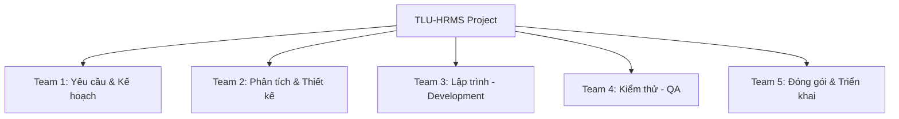
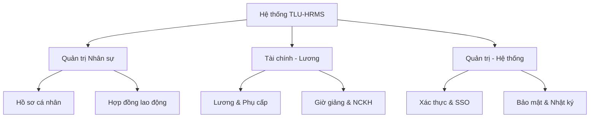

# BÁO CÁO DỰ ÁN: HỆ THỐNG QUẢN TRỊ NHÂN SỰ TLU-HRMS
## (BÁO CÁO TỔNG HỢP TEAM 1 - TUẦN 2)

**Học phần:** Phát triển Dự án Phần mềm  
**Đơn vị:** Nhóm 01 - Team 1 (Yêu cầu & Lập kế hoạch)

---

## CHƯƠNG 1: THU THẬP YÊU CẦU KHÁCH HÀNG VÀ LẬP KẾ HOẠCH

### 1.1. Tổng quan
#### 1.1.1. Giới thiệu dự án
*   **Tên dự án:** Hệ thống Quản trị Nhân sự (TLU-HRMS).
*   **Mục đích dự án:**
    *   **Trải nghiệm người dùng:** Giao diện trực quan, hỗ trợ đa thiết bị giúp CBGV tra cứu lương, hồ sơ cá nhân.
    *   **Cơ sở hạ tầng:** Kiến trúc phân tán (Spring Boot & Angular), hỗ trợ hàng nghìn người dùng đồng thời.
    *   **Căn chỉnh nghiệp vụ:** Tích hợp quy trình Tuyển dụng, Hồ sơ, Lương, Đánh giá thành một luồng dữ liệu thông suốt.
    *   **Phân tích nhân sự (HR Analytics):** Cung cấp báo cáo về hiệu suất, biến động nhân sự và năng suất làm việc.
*   **Các module chính:** Hồ sơ (ER), Tiền lương (PB), Giờ giảng (TL), Đào tạo (TD), Đánh giá (PR), Giao tiếp (CM), Bảo mật & Đạo văn hồ sơ.

#### 1.1.2. Phạm vi dự án
*   **Phạm vi chức năng:** Các quy trình quản trị nhân sự tập trung của Trường Đại học Thủy lợi.
*   **Phạm vi dữ liệu:** 1.200 bộ hồ sơ CBGV; Dữ liệu tài chính (Lương, Thuế, BHXH); Dữ liệu chuyên môn (Giờ dạy, NCKH).
*   **Yêu cầu kỹ thuật:** Spring Boot, Angular, MySQL, Docker, OAuth 2.0.

#### 1.1.3. Các bên tham gia
*   **Khách hàng:** Trường Đại học Thủy lợi (Ban Giám hiệu, Phòng TCCB, TCKT).
*   **Người dùng:** Giảng viên, Nhân viên, Sinh viên, Quản trị viên.
*   **Nhóm sản xuất:** Nhóm 01 (14 người, 5 Team).
*   **Các vai trò hỗ trợ:** Kỹ thuật viên IT, Đội hỗ trợ khách hàng, Đội QA/Tester, Database Administrators (DBA), Configuration Manager.

#### 1.1.4. Tìm hiểu yêu cầu khách hàng
##### 1.1.4.1. Tác nhân dự án
Hệ thống xác định 5 tác nhân chính: Admin, Giảng viên/Nhân viên, Cán bộ TCCB, Cán bộ Kế toán, Lãnh đạo.

##### 1.1.4.2. Yêu cầu chi tiết từ người dùng
*   **Sinh viên/Giảng viên:** Tra cứu thông tin, nộp đơn nghỉ phép, nhận phản hồi tức thời về hồ sơ/lương.
*   **Cán bộ TCCB/TCKT:** Quản lý hồ sơ 2C, tính lương tự động, xuất báo cáo bank, quản lý hợp đồng.
*   **Quản trị viên (Admin):** Giám sát hệ thống, quản lý tài khoản, cấu hình bảo mật.

#### 1.1.5. Điều lệ dự án
*   **Thời gian:** 12/02/2025 – 16/03/2025.
*   **Mô hình:** Waterfall cải tiến.
*   **Vòng đời:** Phân tích (W1-2) -> Thiết kế (W3-5) -> Lập trình (W6-12) -> Kiểm thử (W13-14) -> Bàn giao (W15).

### 1.2. Lập kế hoạch
#### 1.2.1. Cấu trúc phân rã công việc (WBS)
##### 1.2.1.1. Phân rã theo team thực hiện


##### 1.2.1.2. Biểu đồ Phân rã chức năng (FDD)


#### 1.2.2. Dự đoán chi phí & Nhân lực
*   **FP (Function Point):** AFP = 388 -> Dự toán chi phí phần mềm: **388.000.000 VNĐ**. Tổng chi phí dự án (gồm nhân công): **648.000.000 VNĐ**.
*   **COCOMO:** Ước tính **11-14 người** để hoàn thành 24.832 dòng code trong 2 tháng.

---

## CHƯƠNG 2: PHÂN TÍCH VÀ ĐẶC TẢ HỆ THỐNG (TEAM 1 ĐẢM NHIỆM)

### 2.1. Biểu đồ Use Case tổng quát
```mermaid
usecaseDiagram
    actor "CBGV/Sinh viên" as USER
    actor "Cán bộ TCCB" as TCCB
    actor "Cán bộ TCKT" as TCKT
    actor "Admin" as AD

    rectangle "Hệ thống TLU-HRMS" {
        usecase "Đăng nhập & Quản lý tài khoản" as UC5
        usecase "Tra cứu thông tin & Nộp đơn" as UC1
        usecase "Quản lý nhân sự & Hồ sơ" as UC2
        usecase "Tính toán Lương & Thuế" as UC3
        usecase "Phê duyệt & Điều hành" as UC4
    }

    USER --> UC5
    USER --> UC1
    TCCB --> UC2
    TCKT --> UC3
    AD --> UC5
    AD --> UC4
```

### 2.2. Danh sách Use Case chức năng
Mọi yêu cầu FR-xxx từ URD được ánh xạ vào các Use Case sau:
*   **UC-AUTH-01:** Đăng nhập & Xác thực người dùng.
*   **UC-ER-01:** Cập nhật thông tin hồ sơ lý lịch.
*   **UC-CM-01:** Quản lý hợp đồng lao động.
*   **UC-TA-01:** Đăng ký và Phê duyệt nghỉ phép.
*   **UC-PB-01:** Tính toán bảng lương hàng tháng.

### 2.3. Đặc tả mẫu Use Case chi tiết: Đăng nhập (UC-AUTH-01)
*   **Actor:** Tất cả người dùng có tài khoản.
*   **Tiền điều kiện:** Tài khoản đã được Admin cấp và đang ở trạng thái Hoạt động.
*   **Luồng chính:**
    1. Người dùng truy cập trang chủ và nhập thông tin xác thực.
    2. Hệ thống kiểm tra thông tin đối chiếu với CSDL nhân sự.
    3. Hệ thống xác định vai trò (Role) theo phân quyền của Team 1.
    4. Điều hướng người dùng vào giao diện chức năng tương ứng.
*   **Luồng ngoại lệ:** Nhập sai mật khẩu quá 5 lần -> Tài khoản bị khóa tạm thời.

---
**Kết luận của Team 1:** Toàn bộ Chương 1 và phần Đặc tả Use Case của Chương 2 đã hoàn tất, sẵn sàng làm đầu vào cho quy trình thiết kế database và class của **Team 2**.
