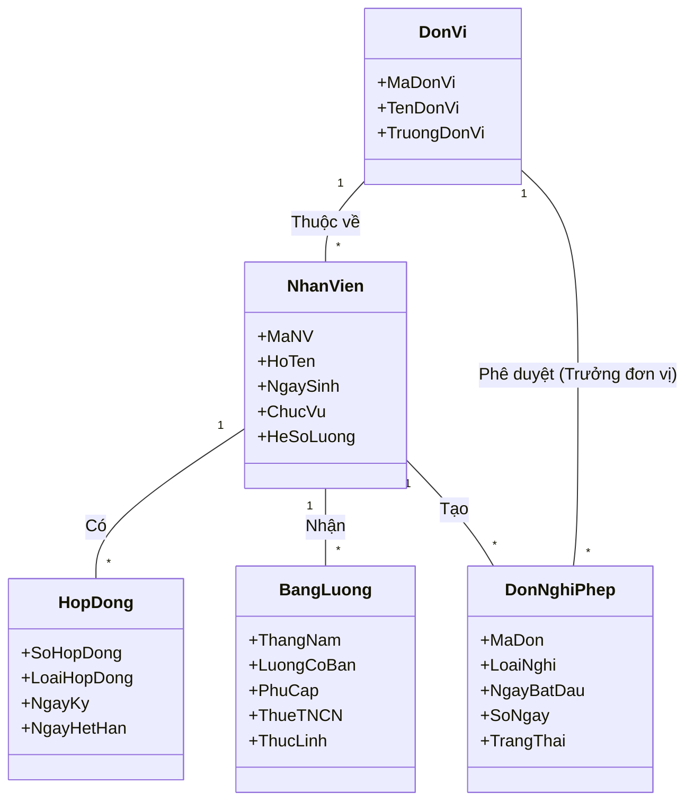

# BÁO CÁO PHÂN TÍCH YÊU CẦU PHẦN MỀM (SRS)
## HỆ THỐNG QUẢN TRỊ NHÂN SỰ TLU-HRMS

**Nhóm thực hiện:** Nhóm 01 - Team 1 (Yêu cầu & Lập kế hoạch)  
**Ngày lập:** 27/01/2026

---

## MỞ ĐẦU (ĐẶT VẤN ĐỀ VÀ NÊU PHẠM VI BÀI TOÁN)
### 1. Đặt vấn đề
Hiện nay, công tác quản lý nhân sự tại Trường Đại học Thủy lợi đang gặp khó khăn do dữ liệu phân tán (Excel/Giấy), gây chậm trễ trong việc tính lương, tổng hợp giờ giảng và tra cứu hồ sơ. Nhu cầu cấp thiết là xây dựng một hệ thống tập trung (Centralized HRMS).

### 2. Phạm vi bài toán
*   **Phạm vi nghiệp vụ:** Quản lý vòng đời nhân sự (Tuyển dụng -> Hợp đồng -> Lương/Thưởng -> Nghỉ hưu).
*   **Phạm vi dữ liệu:** 1.200 CBGV tại 3 cơ sở đào tạo.
*   **Người dùng:** Toàn bộ giảng viên, nhân viên và lãnh đạo nhà trường.

---

## I. BẢN KẾ HOẠCH QUẢN LÝ YÊU CẦU
### 1.1. Tổ chức đội ngũ (Team Roles)
Dự án được phân chia thành 5 nhóm chuyên trách để xử lý yêu cầu:
*   **Team 1 (BA/PM):** Thu thập, phân tích và tài liệu hóa yêu cầu.
*   **Team 2 (SA/Design):** Chuyển đổi yêu cầu thành thiết kế hệ thống.
*   **Team 3 (Dev):** Hiện thực hóa yêu cầu thành phần mềm.
*   **Team 4 (Test):** Kiểm chứng yêu cầu trên sản phẩm thực tế.
*   **Team 5 (Deploy):** Triển khai và hướng dẫn sử dụng.

### 1.2. Quy trình quản lý thay đổi (Change Control)
Mọi yêu cầu thay đổi (CR) từ phía Stakeholders phải được Team 1 đánh giá tác động (Impact Analysis) trước khi cập nhật vào tài liệu SRS và thông báo cho Team 2, 3.

---

## II. THU THẬP YÊU CẦU TỪ CÁC STAKEHOLDERS
### 2.1. Xác định các Stakeholders
1.  **Chủ đầu tư:** Ban Giám hiệu.
2.  **Người dùng chính (Key Users):** Phòng TCCB (Quản lý hồ sơ), Phòng TCKT (Tính lương).
3.  **Người dùng cuối (End Users):** Giảng viên, Nhân viên.
4.  **Hỗ trợ kỹ thuật:** Trung tâm Tin học.

### 2.2. Xác định yêu cầu cấp cao (STRQ & FEAT)
*   **STRQ-01:** Hệ thống phải quản lý được hồ sơ viên chức theo mẫu nhà nước.
    *   *FEAT-01:* Nhập liệu và xuất báo cáo mẫu 2C/BNV.
    *   *FEAT-02:* Quản lý lịch sử diễn biến lương và quá trình công tác.
*   **STRQ-02:** Hệ thống phải tính lương tự động chính xác 100%.
    *   *FEAT-03:* Công thức tính lương động (Hệ số * Lương CS + Phụ cấp).
    *   *FEAT-04:* Tự động trừ thuế TNCN và BHXH.
*   **STRQ-03:** Giảng viên có thể tương tác trực tuyến.
    *   *FEAT-05:* Cổng Self-Service xem Payslip và Hồ sơ.
    *   *FEAT-06:* Đăng ký nghỉ phép và bù giờ dạy online.
*   **STRQ-04:** Quản lý quy trình tuyển dụng và đào tạo.
    *   *FEAT-07:* Đăng tin tuyển dụng và sàng lọc hồ sơ ứng viên.
    *   *FEAT-08:* Quản lý kế hoạch bồi dưỡng chuyên môn và chứng chỉ.
*   **STRQ-05:** Báo cáo quản trị thông minh.
    *   *FEAT-09:* Dashboard biến động nhân sự, tỷ lệ thạc sĩ/tiến sĩ.
    *   *FEAT-10:* Báo cáo quỹ lương dự kiến hàng năm.

---

## III. MÔ HÌNH HOÁ YÊU CẦU (USE CASE DIAGRAM)
### 3.1. Sơ đồ Use Case tổng quát
```mermaid
usecaseDiagram
    actor "CBGV/Nhân viên" as USER
    actor "Cán bộ TCCB" as TCCB
    actor "Cán bộ TCKT" as TCKT
    actor "Lãnh đạo" as ADMIN

    rectangle "HỆ THỐNG TLU-HRMS" {
        usecase "Đăng nhập/SSO" as UC_AUTH
        usecase "Tra cứu Hồ sơ & Lương" as UC_VIEW
        usecase "Đăng ký Nghỉ phép" as UC_LEAVE
        usecase "Quản lý Hồ sơ Nhân sự" as UC_HRM
        usecase "Quản lý Hợp đồng" as UC_CONT
        usecase "Tính toán Lương & Thuế" as UC_PAY
        usecase "Phê duyệt tờ trình" as UC_APR
    }

    USER --> UC_AUTH
    USER --> UC_VIEW
    USER --> UC_LEAVE
    TCCB --> UC_HRM
    TCCB --> UC_CONT
    TCKT --> UC_PAY
    ADMIN --> UC_APR
```

---

## IV. LUỒNG SỰ KIỆN CHO CÁC USE CASE CHÍNH
### 4.1. UC-AUTH: Đăng nhập hệ thống
*   **Tác nhân:** Mọi người dùng.
*   **Luồng chính:** (1) Nhập User/Pass -> (2) Hệ thống xác thực -> (3) Kiểm tra quyền -> (4) Hiển thị Dashboard.

### 4.2. UC-TA-01: Đăng ký nghỉ phép
*   **Tác nhân:** CBGV.
*   **Luồng chính:**
    1.  Người dùng chọn menu "Nghỉ phép" -> "Tạo mới".
    2.  Nhập lý do, thời gian, người bàn giao.
    3.  Hệ thống kiểm tra số ngày phép còn lại.
    4.  Nhấn "Gửi". Hệ thống lưu đơn và gửi Email cho Trưởng đơn vị.
*   **Luồng rẽ nhánh:** Nếu hết ngày phép -> Thông báo lỗi và gợi ý chuyển sang "Nghỉ không lương".

### 4.3. UC-ER-01: Cập nhật Hồ sơ cá nhân (2C/BNV)
*   **Tác nhân:** Cán bộ TCCB.
*   **Luồng chính:**
    1.  TCCB tìm kiếm nhân viên theo Mã hoặc Tên.
    2.  Chọn tab "Sơ yếu lý lịch".
    3.  Hệ thống hiển thị form nhập liệu chuẩn mẫu 2C (Thông tin chung, Quá trình đào tạo, Khen thưởng).
    4.  TCCB nhập thông tin mới hoặc đính kèm file scan bằng cấp.
    5.  Hệ thống validate định dạng ngày tháng và file upload.
    6.  Lưu thông tin và ghi nhật ký hệ thống.
*   **Luồng rẽ nhánh:** Nếu file đính kèm quá 5MB -> Cảnh báo lỗi.

### 4.4. UC-PB-02: Tính lương hàng tháng
*   **Tác nhân:** Cán bộ TCKT.
*   **Luồng chính:**
    1.  Hệ thống tự động chốt công vào ngày 25 hàng tháng.
    2.  TCKT chọn "Lập bảng lương tháng X".
    3.  Hệ thống quét toàn bộ hợp đồng đang hiệu lực để lấy Hệ số lương.
    4.  Hệ thống cộng các khoản Phụ cấp (Chức vụ + Thâm niên + Độc hại).
    5.  Hệ thống trừ các khoản trích nộp (BHXH 10.5% + Thuế TNCN lũy tiến).
    6.  Xuất bảng lương nháp để TCKT kiểm tra.
    7.  TCKT xác nhận -> Hệ thống gửi payslip qua email cho từng CBGV.

---

## V. XÁC ĐỊNH CÁC LỚP, XÂY DỰNG BIỂU ĐỒ LỚP (DOMAIN MODEL)
*Ghi chú: Đây là Mô hình Lớp Lĩnh vực (Business Domain Class Diagram) dùng để phân tích các thực thể nghiệp vụ và mối quan hệ giữa chúng, chưa phải là biểu đồ thiết kế chi tiết (Design Class Diagram).*

### 5.1. Phân tích các thực thể chính
1.  **NhanVien (Employee):** Thông tin cơ bản của nhân sự.
2.  **HopDong (Contract):** Một nhân viên có thể có nhiều hợp đồng theo thời gian.
3.  **DonVi (Department):** Phòng ban/Khoa mà nhân viên thuộc về.
4.  **BangLuong (Payroll):** Bảng chi tiết lương hàng tháng của nhân viên.
5.  **DonNghiPhep (LeaveRequest):** Đơn xin nghỉ cần phê duyệt.

### 5.2. Biểu đồ Lớp Lĩnh vực (Domain Class Diagram)


**Giải thích ý nghĩa:**
*   Sơ đồ trên cho thấy cấu trúc dữ liệu logic của bài toán HRMS.
*   Một **Nhân viên** thuộc về một **Đơn vi**, có nhiều **Hợp đồng** lịch sử.
*   Hàng tháng, hệ thống sinh ra một **Bảng lương** cho mỗi nhân viên.
*   Nhân viên có thể tạo nhiều **Đơn nghỉ phép**, đơn này được quản lý bởi Đơn vị.

---

## VI. CÁC YÊU CẦU BỔ SUNG (NON-FUNCTIONAL REQUIREMENTS)
### 6.1. Hiệu năng (Performance)
*   Hệ thống phải chịu tải được 500 người dùng truy cập cùng lúc (giờ cao điểm chốt công).
*   Thời gian tính lương cho 1.200 nhân sự không quá 5 phút.

### 6.2. Bảo mật (Security)
*   Mật khẩu phải được mã hóa (Hashing).
*   Mọi thao tác thay đổi lương phải được ghi log (Audit Trail).

### 6.3. Tính khả dụng (Availability)
*   Hệ thống hoạt động 24/7, thời gian uptime cam kết 99.9%.

---

## VII. TÀI LIỆU ĐẶC TẢ YÊU CẦU SRS (SUMMARY)
Tài liệu này (Chương I đến VI) cấu thành nên bộ Đặc tả Yêu cầu Phần mềm (SRS) phiên bản 1.0 cho dự án TLU-HRMS. Nó là cơ sở pháp lý và kỹ thuật để:
1.  **Team 2:** Thực hiện thiết kế CSDL và Kiến trúc hệ thống.
2.  **Team 3:** Lập trình tính năng.
3.  **Team 4:** Viết Test Case kiểm thử nghiệm thu (UAT).

---
*Người lập báo cáo: Team 1 (Nhóm 01)*
