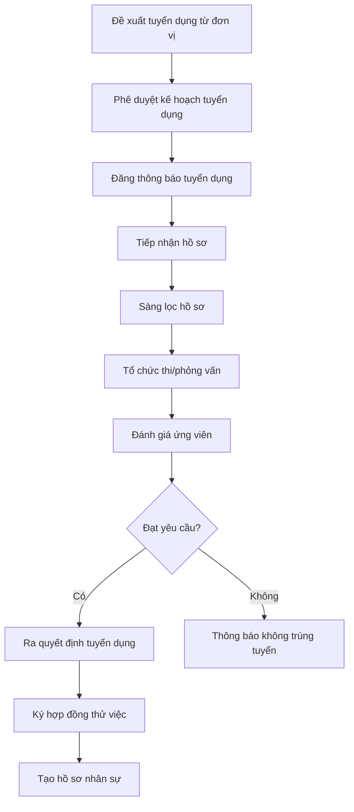
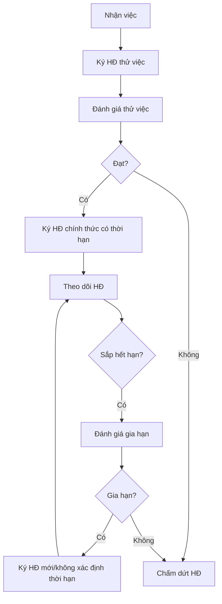
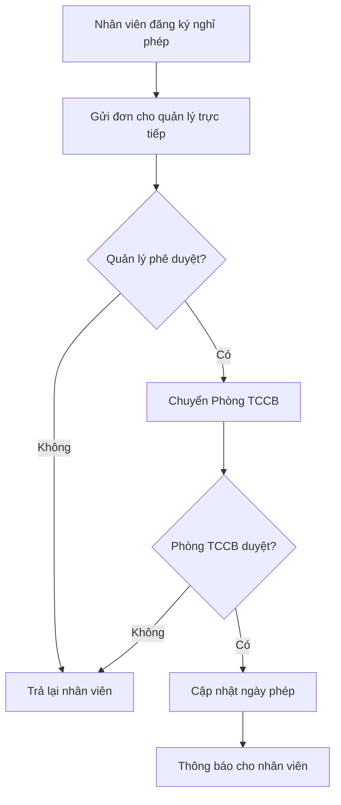
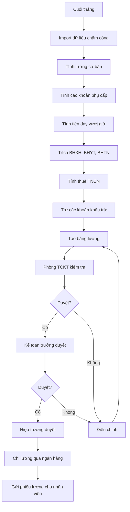
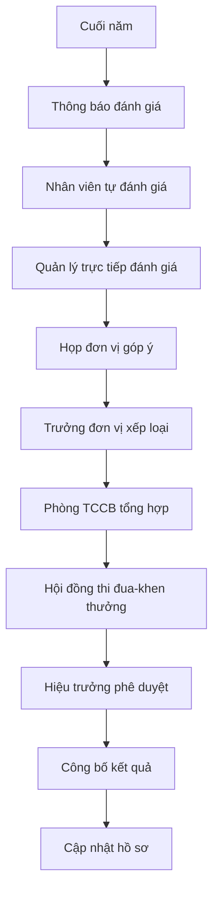

# Tài liệu Đặc tả Yêu cầu Người dùng

# Hệ thống Quản lý Nhân sự (HRMS) - Trường Đại học Thủy lợi

> **Phiên bản:** 1.0  
> **Ngày tạo:** 21/01/2026  
> **Dự án:** Phân tích và Thiết kế Phần mềm - Hệ thống Quản lý Nhân sự  
> **Đơn vị:** Trường Đại học Thủy lợi (TLU)

---

## Mục lục

1. [Giới thiệu](#1-giới-thiệu)
2. [Bối cảnh và Phạm vi](#2-bối-cảnh-và-phạm-vi)
3. [Các bên liên quan (Stakeholders)](#3-các-bên-liên-quan-stakeholders)
4. [Yêu cầu chức năng](#4-yêu-cầu-chức-năng)
    - 4.1 - 4.12: Các module nghiệp vụ
    - 4.13: Module Quản lý Cấu hình Hệ thống (System Configuration Management)
5. [Yêu cầu phi chức năng](#5-yêu-cầu-phi-chức-năng)
6. [Mô hình nghiệp vụ](#6-mô-hình-nghiệp-vụ)
7. [Phụ lục](#7-phụ-lục)

---

## 1. Giới thiệu

### 1.1 Mục đích tài liệu

Tài liệu này mô tả chi tiết các yêu cầu người dùng cho Hệ thống Quản lý Nhân sự (Human Resource Management System - HRMS) được phát triển riêng cho Trường Đại học Thủy lợi. Tài liệu phục vụ làm cơ sở để:

- Phân tích và thiết kế hệ thống
- Xác định phạm vi và các tính năng cần phát triển
- Làm tài liệu tham chiếu cho việc kiểm thử và nghiệm thu

### 1.2 Giới thiệu về Trường Đại học Thủy lợi

**Trường Đại học Thủy lợi (Thuyloi University - TLU)** là cơ sở giáo dục đại học công lập trực thuộc Bộ Nông nghiệp và Môi trường với hơn **65 năm** lịch sử phát triển.

| Thông tin                | Chi tiết                                          |
| ------------------------ | ------------------------------------------------- |
| Thành lập                | 1959 (tiền thân: Học viện Thủy lợi Điện lực)      |
| Loại hình                | Đại học công lập                                  |
| Cơ quan chủ quản         | Bộ Nông nghiệp và Môi trường                      |
| Quy mô sinh viên         | 24,000+ người học                                 |
| Số CBGV                  | **1,203 người** (số liệu 2025)                    |
| Số ngành đào tạo         | 43 chương trình đại học, 17 thạc sĩ, 15 tiến sĩ   |
| Tỷ lệ giảng viên tiến sĩ | **61.3%** (một trong những tỷ lệ cao nhất VN)     |
| Đối tác                  | 500+ trong và ngoài nước                          |
| Cơ sở                    | Hà Nội (175 Tây Sơn), Phố Hiến (Hưng Yên), TP.HCM |

---

## 2. Bối cảnh và Phạm vi

### 2.1 Cơ cấu tổ chức cần quản lý

#### 2.1.1 Các đơn vị quản lý, phục vụ (Phòng/Ban)

| STT | Tên đơn vị                            | Mã đơn vị |
| --- | ------------------------------------- | --------- |
| 1   | Phòng Hành chính - Tổng hợp           | HCTH      |
| 2   | Phòng Tổ chức Cán bộ                  | TCCB      |
| 3   | Phòng Đào tạo                         | DT        |
| 4   | Phòng Khảo thí và Đảm bảo chất lượng  | KTDBCL    |
| 5   | Phòng Chính trị và Công tác sinh viên | CTCTSV    |
| 6   | Phòng Khoa học công nghệ              | KHCN      |
| 7   | Phòng Hợp tác quốc tế                 | HTQT      |
| 8   | Phòng Tài chính - Kế toán             | TCKT      |
| 9   | Phòng Quản trị - Thiết bị             | QTTB      |
| 10  | Thư viện                              | TV        |
| 11  | Trung tâm Nội trú                     | TTNT      |
| 12  | Trung tâm Tin học                     | TTTH      |
| 13  | Trạm Y tế                             | TYT       |

#### 2.1.2 Các đơn vị đào tạo (Khoa/Trung tâm)

| STT | Tên đơn vị                               | Mã đơn vị | Website              |
| --- | ---------------------------------------- | --------- | -------------------- |
| 1   | Khoa Công trình                          | KCT       | ce.tlu.edu.vn        |
| 2   | Khoa Kỹ thuật tài nguyên nước            | KKTTN     | kttnn.tlu.edu.vn     |
| 3   | Khoa Cơ khí                              | KCK       | khoacokhi.tlu.edu.vn |
| 4   | Khoa Điện - Điện tử                      | KDDT      | ee.tlu.edu.vn        |
| 5   | Khoa Kinh tế và Quản lý                  | KKTQL     | fem.tlu.edu.vn       |
| 6   | Khoa Kế toán và Kinh doanh               | KKTKD     | fab.tlu.edu.vn       |
| 7   | Khoa Công nghệ thông tin                 | KCNTT     | cse.tlu.edu.vn       |
| 8   | Khoa Hóa và Môi trường                   | KHMT      | env.tlu.edu.vn       |
| 9   | Khoa Luật và Lý luận Chính trị           | KLLCT     | pl.tlu.edu.vn        |
| 10  | Trung tâm Đào tạo quốc tế                | TTDTQT    | sie.tlu.edu.vn       |
| 11  | Trung tâm Giáo dục Quốc phòng và An ninh | TTGDQPAN  | ttgdqp.tlu.edu.vn    |
| 12  | Phân hiệu Đại học Thủy lợi (TP.HCM)      | PHDHTL    | tlus.edu.vn          |

##### Chi tiết Cơ cấu Bộ môn trong các Khoa

> [!NOTE]
> Thông tin chi tiết về cơ cấu bộ môn dưới đây được thu thập từ website các Khoa nhằm thiết kế chính xác cấu trúc phân cấp tổ chức trong hệ thống HRMS.

**1. Khoa Công nghệ thông tin (KCNTT)**

- Địa chỉ: Nhà C1, 175 Tây Sơn, Đống Đa, Hà Nội
- Email: vpkcntt@tlu.edu.vn
- Các bộ môn:
  | STT | Tên Bộ môn |
  | --- | ------------------------------- |
  | 1 | Bộ môn Công nghệ phần mềm |
  | 2 | Bộ môn Hệ thống thông tin |
  | 3 | Bộ môn Mạng và An toàn thông tin|
  | 4 | Bộ môn Tin học và Kỹ thuật tính toán |
  | 5 | Bộ môn Trí tuệ nhân tạo |
  | 6 | Bộ môn Toán học |
- Phòng thí nghiệm: Có các PTN phục vụ nghiên cứu và đào tạo

**2. Khoa Công trình (KCT) - Viện Kỹ thuật Công trình (VKTCT)**

- Đặc thù: Khoa Công trình hoạt động song song với Viện Kỹ thuật Công trình, có cùng Trưởng khoa kiêm Viện trưởng
- Chức năng: Đào tạo + Tư vấn thiết kế + Nghiên cứu khoa học
- Địa chỉ: Phòng 402, Tầng 4, nhà A1, 175 Tây Sơn, Kim Liên, Hà Nội
- Điện thoại: (024) 3852.2024
- Email: vpkct@tlu.edu.vn
- **Thống kê nhân sự:**
  | Chỉ tiêu | Số lượng |
  | ---------------------- | -------- |
  | Nhà giáo nhân dân | 05 |
  | Nhà giáo ưu tú | 30 |
  | Giáo sư | 07 |
  | Phó Giáo sư | 18 |
  | Tiến sĩ | 50 |
  | Thạc sĩ | 11 |
  | Giảng viên đang làm NCS| 41 |
- Các bộ môn (10 bộ môn):
  | STT | Tên Bộ môn |
  | --- | -------------------------------------- |
  | 1 | Bộ môn Thủy công |
  | 2 | Bộ môn Công nghệ và Quản lý xây dựng |
  | 3 | Bộ môn Kết cấu Công trình |
  | 4 | Bộ môn Sức bền - Kết cấu |
  | 5 | Bộ môn Địa kỹ thuật |
  | 6 | Bộ môn Vật liệu xây dựng |
  | 7 | Bộ môn Công trình giao thông |
  | 8 | Bộ môn Xây dựng dân dụng và Công nghiệp|
  | 9 | Bộ môn Thủy điện và Năng lượng tái tạo |
  | 10 | Bộ môn Công trình Biển và Đường thủy |
- Viện Kỹ thuật Công trình (song song với Khoa):
    - Đội ngũ: 100 người (06 PGS, 03 TS, 30 ThS) + 100 cộng tác viên
    - Gồm 09 trung tâm và 01 phòng
- Ghi chú HRMS: Cần hỗ trợ cấu trúc Khoa-Viện song song, một người có thể giữ 2 chức vụ

**3. Khoa Cơ khí (KCK)**

- Năm thành lập: 1986
- Địa chỉ: Phòng 312-314, nhà A1, 175 Tây Sơn, Đống Đa, Hà Nội
- Email: khoaM@tlu.edu.vn
- Điện thoại: (04) 3853.3082
- **Thống kê nhân sự mẫu:**
  | Chỉ tiêu | Số lượng |
  | ---------------------- | -------- |
  | Tổng cán bộ, giảng viên| 62 |
  | Giáo sư, Phó Giáo sư | 08 |
  | Tiến sĩ | 24 |
  | Nghiên cứu sinh | 11 |
  | Thạc sĩ | 18 |
  | Nhà giáo ưu tú | 06 |
- Ban chủ nhiệm khoa:
    - Trưởng Khoa: PGS.TS Đoàn Yên Thế
    - Phó trưởng khoa: TS. Nguyễn Ngọc Huyên
    - Phó trưởng khoa: PGS.TS Nguyễn Anh Tuấn
- Các bộ môn (6 bộ môn):
  | STT | Tên Bộ môn | Trưởng BM |
  | --- | ----------------------------- | --------------------------- |
  | 1 | Bộ môn Công nghệ cơ khí | TS. Phan Bình Nguyên |
  | 2 | Bộ môn Kỹ thuật hệ thống công nghiệp | PGS.TS Nguyễn Anh Tuấn |
  | 3 | Bộ môn Kỹ thuật ô tô | PGS.TS Nguyễn Đức Ngọc |
  | 4 | Bộ môn Kỹ thuật cơ điện tử | TS. Nguyễn Huy Thế |
  | 5 | Bộ môn Cơ học kỹ thuật | TS. Nguyễn Thị Thanh Bình |
  | 6 | Bộ môn Đồ họa kỹ thuật | ThS.Kts. Nguyễn Việt Anh |
- Phòng thí nghiệm (4 PTN):
    - PTN Kỹ thuật Hệ thống Công nghiệp
    - PTN Vật liệu kỹ thuật và Kỹ thuật đo
    - PTN Kỹ thuật ô tô
    - Phòng Thực hành Mô phỏng số và Robot
- Xưởng thực hành (2 xưởng):
    - Xưởng Cơ khí
    - Xưởng thực hành Kỹ thuật Ô tô
- Trung tâm: Trung tâm KHCN Cơ học và Máy Thủy lợi
- Ngành đào tạo: Kỹ thuật cơ khí, Công nghệ chế tạo máy, Kỹ thuật ô tô, Kỹ thuật cơ điện tử

**4. Khoa Điện - Điện tử (KDDT)**

- Website: ee.tlu.edu.vn
- Địa chỉ: Phòng 106-109, Nhà B5, 175 Tây Sơn, Đống Đa, Hà Nội
- Ban chủ nhiệm khoa:
    - Trưởng khoa: TS. Nguyễn Nhất Tùng
    - Phó trưởng khoa: TS. Nguyễn Quang Thuấn
    - Phó trưởng khoa: PGS.TS. Phạm Đức Đại
- Văn phòng khoa: ThS. Cao Thị Nụ, ThS. Nguyễn Thị Thúy An
- Các bộ môn (5 bộ môn):
  | STT | Tên Bộ môn | Trưởng BM |
  | --- | ----------------------------------------- | ------------------------ |
  | 1 | Bộ môn Vật lý | PGS.TS. Phan Văn Độ |
  | 2 | Bộ môn Kỹ thuật điện, điện tử | PGS.TS. Nguyễn Minh Ý |
  | 3 | Bộ môn Kỹ thuật điều khiển và Tự động hóa | PGS.TS. Phạm Đức Đại |
  | 4 | Bộ môn Điện tử viễn thông | TS. Trần Văn Hội |
  | 5 | Bộ môn Kỹ thuật Robot và Hệ thống thông minh | PGS.TS. Lê Trung Dũng |
- Trung tâm: Trung tâm Kỹ thuật Điện và Tự động hóa
- Phòng thí nghiệm (4 PTN):
    - PTN Vật lý (Nhà B5 - 175 Tây Sơn)
    - PTN Kỹ thuật điện (Hưng Yên và Hà Nội)
    - PTN Hệ thống nhúng, IoT và Điện tử viễn thông (109 Nhà B5)
    - PTN Kỹ thuật điều khiển và Tự động hóa (108 Nhà B5)
- Ngành đào tạo: Kỹ thuật điện, Kỹ thuật điện tử - viễn thông, Kỹ thuật điều khiển và tự động hóa, Kỹ thuật Robot

**5. Khoa Hóa và Môi trường (KHMT)**

- Địa chỉ: P316-317, nhà A5, 175 Tây Sơn, Đống Đa, Hà Nội
- Điện thoại: 024.3564.0704
- Ban chủ nhiệm khoa:
    - Phó Trưởng khoa (Phụ trách): PGS.TS Nguyễn Thị Lan Hương
    - Phó Trưởng khoa: TS Trịnh Đình Khá
- Sứ mệnh: Đào tạo nguồn nhân lực chất lượng cao trong lĩnh vực môi trường, công nghệ sinh học và kỹ thuật hóa học
- Các bộ môn:
  | STT | Tên Bộ môn | Địa chỉ văn phòng |
  | --- | ------------------------------- | ------------------ |
  | 1 | Bộ môn Kỹ thuật và Quản lý Môi trường | (thành lập 1993) |
  | 2 | Bộ môn Kỹ thuật Hóa học | P313 - Nhà A5 |
  | 3 | Bộ môn Công nghệ sinh học | (thành lập 11/2018)|

**6. Khoa Kỹ thuật tài nguyên nước (KKTTN)**

- Địa chỉ: Phòng 301-307 Nhà A1, 175 Tây Sơn, Kim Liên, Hà Nội
- Điện thoại: 0243.852.8026
- Email: khoaTNN@tlu.edu.vn
- Website: kttnn.tlu.edu.vn
- **Thống kê nhân sự:**
  | Chỉ tiêu | Số lượng |
  | ---------------------- | -------- |
  | Tổng cán bộ, giảng viên| 62 |
  | Giáo sư | 01 |
  | Phó Giáo sư | 17 |
  | Tiến sĩ | 33 |
  | Thạc sĩ | 10 |
  | Kỹ sư | 01 |
- Ban chủ nhiệm khoa:
    - Trưởng khoa (kiêm Viện trưởng Viện KTTNN): PGS.TS. Lê Văn Chín
    - Phó trưởng khoa (kiêm Viện trưởng Viện TV, MT & BĐKH): GS.TS. Phạm Thị Hương Lan
    - Phó trưởng khoa: PGS.TS. Đặng Minh Hải
    - Phó trưởng khoa (kiêm P. Viện trưởng Viện TV, MT & BĐKH): PGS.TS. Hoàng Thanh Tùng
- Các bộ môn (7 bộ môn):
  | STT | Tên Bộ môn | Trưởng BM |
  | --- | --------------------------------- | -------------------------- |
  | 1 | Bộ môn Kỹ thuật Tài nguyên nước | TS. Nguyễn Quang Phi |
  | 2 | Bộ môn Thủy lực | PGS.TS. Hồ Việt Hùng |
  | 3 | Bộ môn Cấp thoát nước | PGS.TS. Đoàn Thu Hà |
  | 4 | Bộ môn Kỹ thuật Hạ tầng | TS. Lưu Văn Quân |
  | 5 | Bộ môn Trắc địa | TS. Lã Phú Hiến |
  | 6 | Bộ môn Thủy văn và Biến đổi khí hậu | PGS.TS. Ngô Lê An |
  | 7 | Bộ môn Kỹ thuật sông và Quản lý thiên tai | GS.TS. Phạm Thị Hương Lan |
- Cơ cấu tổ chức: Có Ban lãnh đạo các thời kỳ được lưu trữ
- Đặc thù: Hoạt động song song với Viện Kỹ thuật Tài nguyên nước và Viện Thủy văn, Môi trường & BĐKH

**7. Khoa Kinh tế và Quản lý (KKTQL)**

- Năm thành lập: 1980 (45 năm lịch sử tính đến 2025)
- Website: fem.tlu.edu.vn
- Địa chỉ: Phòng 218-222, nhà A1, 175 Tây Sơn, Đống Đa, Hà Nội
- Hoạt động: Hội nghị viên chức, người lao động hàng năm; Nghiên cứu khoa học sinh viên; Công đoàn bộ phận
- Các bộ môn và trung tâm (8 đơn vị):
  | STT | Tên Bộ môn/Trung tâm |
  | --- | ---------------------------------- |
  | 1 | Bộ môn Kinh tế |
  | 2 | Bộ môn Kinh tế xây dựng |
  | 3 | Bộ môn Quản trị du lịch |
  | 4 | Bộ môn Thương mại điện tử |
  | 5 | Bộ môn Logistics và chuỗi cung ứng |
  | 6 | Bộ môn Kinh tế và Kinh doanh số |
  | 7 | Bộ môn Phát triển kỹ năng |
  | 8 | Trung tâm Kinh tế và Quản lý |
- Ngành đào tạo: Kinh tế, Kinh tế xây dựng, Quản trị kinh doanh, Quản trị du lịch, Thương mại điện tử, Logistics và chuỗi cung ứng

**8. Trung tâm Đào tạo quốc tế (TTDTQT)**

- Cơ cấu tổ chức:
  | STT | Đơn vị |
  | --- | ------------------------------- |
  | 1 | Ban Giám đốc |
  | 2 | Văn phòng Trung tâm |
  | 3 | Bộ môn Tiếng Anh |
  | 4 | Bộ môn Ngôn ngữ Anh |
  | 5 | Bộ môn Ngôn ngữ Trung Quốc |
- Đối tác quốc tế: Nhiều trường đại học quốc tế
- Chức năng: Đào tạo chương trình tiên tiến, liên kết quốc tế

**9. Trung tâm Giáo dục Quốc phòng và An ninh (TTGDQPAN)**

- Website: ttgdqp.tlu.edu.vn
- Chức năng: Đào tạo giáo dục quốc phòng an ninh cho sinh viên

> [!IMPORTANT]
> **Yêu cầu HRMS từ cơ cấu tổ chức:**
>
> - Hỗ trợ cấu trúc phân cấp: Trường → Khoa/Viện/Trung tâm → Bộ môn → Giảng viên
> - Quản lý chức vụ kiêm nhiệm (1 người có thể giữ nhiều chức vụ ở các đơn vị khác nhau)
> - Quản lý lịch sử lãnh đạo qua các thời kỳ
> - Quản lý phòng thí nghiệm gắn với đơn vị
> - Hỗ trợ các loại đơn vị: Khoa, Viện, Trung tâm, Bộ môn, Phòng thí nghiệm

#### 2.1.3 Các đơn vị KHCN kết hợp đào tạo (Viện/Trung tâm nghiên cứu)

| STT | Tên đơn vị                                                   | Mã đơn vị |
| --- | ------------------------------------------------------------ | --------- |
| 1   | Viện Đào tạo và KHƯD Miền Trung                              | VDTKHUDMT |
| 2   | Trung tâm Khoa học và Thiết kế KTTL                          | TTKHTK    |
| 3   | Văn phòng Tư vấn thẩm định thiết kế                          | VPTVTD    |
| 4   | Viện Kỹ thuật tài nguyên nước                                | VKTTNN    |
| 5   | Viện Kỹ thuật công trình                                     | VKTCT     |
| 6   | Viện Thủy văn, Môi trường và BĐKH                            | VTVMTBDKH |
| 7   | Viện Thủy lợi và Môi trường (TP.HCM)                         | VTLMT_HCM |
| 8   | Công ty TNHH Tư vấn Trường ĐHTL                              | CTYTVTL   |
| 9   | Trung tâm Nước và Môi trường VN-Hà Lan                       | TTMTVNHL  |
| 10  | Viện Nghiên cứu Ứng dụng CN và Hợp tác Doanh nghiệp (IARTEP) | VIARTEP   |

##### Chi tiết Viện Nghiên cứu Ứng dụng Công nghệ và Hợp tác Doanh nghiệp (IARTEP)

- Tên tiếng Anh: Institute for Applied Research, Technology and Enterprise Partnership
- Website: iartep.com
- Số nhân sự: 12 cán bộ
- Các đơn vị trực thuộc (5 trung tâm):
  | STT | Tên Trung tâm |
  | --- | ---------------------------------------------- |
  | 1 | Trung tâm Nghiên cứu Ứng dụng Công nghệ |
  | 2 | Trung tâm Hợp tác Doanh nghiệp |
  | 3 | Trung tâm Đổi mới Sáng tạo và Khởi nghiệp |
  | 4 | Trung tâm Phát triển Nguồn nhân lực |
  | 5 | Trung tâm Chuyển giao Công nghệ |
- Chức năng: Nghiên cứu ứng dụng, hợp tác doanh nghiệp, chuyển giao công nghệ

#### 2.1.4 Các cơ sở/chi nhánh

| STT | Cơ sở            | Địa điểm                     | Ghi chú                                |
| --- | ---------------- | ---------------------------- | -------------------------------------- |
| 1   | Cơ sở chính      | 175 Tây Sơn, Đống Đa, Hà Nội | Trụ sở chính                           |
| 2   | Cơ sở Phố Hiến   | Hưng Yên                     | Đào tạo, nghiên cứu                    |
| 3   | Phân hiệu TP.HCM | TP. Hồ Chí Minh              | Có Ban Giám đốc, phòng ban, khoa riêng |

##### Chi tiết Phân hiệu Đại học Thủy lợi tại TP.HCM (PHDHTL)

- Website: tlus.edu.vn
- Địa chỉ: 02 Trường Sa, Phường 17, Quận Bình Thạnh, TP. Hồ Chí Minh
- Điện thoại: (028) 3512.0730
- Năm thành lập: 2004
- Chức năng: Đào tạo đại học, sau đại học các ngành kỹ thuật tại khu vực phía Nam
- Cơ cấu tổ chức:
    - Ban Giám đốc (Giám đốc, các Phó Giám đốc)
    - Các phòng ban: Phòng Đào tạo, Phòng Tổ chức - Hành chính, Phòng KHCN-HTQT
    - Các khoa: Khoa Công trình, Khoa Kỹ thuật tài nguyên nước, Khoa Kinh tế và Quản lý
    - Viện Thủy lợi và Môi trường (TP.HCM)
- Ngành đào tạo: Kỹ thuật xây dựng công trình thủy, Kỹ thuật tài nguyên nước, Quản lý xây dựng, Kinh tế xây dựng
- Ghi chú HRMS: Cần quản lý riêng nhân sự Phân hiệu với cơ cấu tổ chức độc lập

### 2.2 Tài liệu tham chiếu từ TLU

> [!NOTE]
> Các tài liệu pháp lý và nội bộ của TLU có thể được sử dụng làm tham chiếu để xây dựng nghiệp vụ hệ thống. Nguồn: `web18.tlu.edu.vn/Van-ban/`

#### 2.2.1 Văn bản pháp luật Nhà nước (Nền tảng pháp lý)

| Số hiệu                   | Tên văn bản               | Ứng dụng trong HRMS                                                                 |
| ------------------------- | ------------------------- | ----------------------------------------------------------------------------------- |
| 26/VBHN-VPQH (16/12/2019) | **Luật Viên chức**        | Định nghĩa vị trí việc làm, tuyển dụng, hợp đồng làm việc, quyền/nghĩa vụ viên chức |
| 45/2019/QH14 (20/11/2019) | **Bộ Luật Lao động 2019** | Giờ làm việc, nghỉ phép, BHXH, bảo hộ lao động                                      |
| 43/2019/QH14 (14/06/2019) | **Luật Giáo dục 2019**    | Tiêu chuẩn nhà giáo, quyền lợi giáo viên                                            |
| 42/VBHN-VPQH (10/12/2018) | **Luật Giáo dục đại học** | Chức danh giảng viên (GV, GVC, GVCC), tiêu chuẩn trình độ                           |

> **Link tải về từ TLU:**
>
> - [Luật Viên chức (PDF)](https://web18.tlu.edu.vn/Portals/0/DocumentFiles/5324_19.12.16.%20VBHN26-VPQH-LuatVC.pdf)
> - [Bộ Luật Lao động 2019 (DOCX)](https://web18.tlu.edu.vn/Portals/0/DocumentFiles/5323_19.11.20.%20BL%20Laodong%202019.docx)
> - [Luật Giáo dục 2019 (PDF)](https://web18.tlu.edu.vn/Portals/0/DocumentFiles/5322_19.06.14.%20LuatGD2019.pdf)

#### 2.2.2 Văn bản nội bộ Trường ĐHTL

| Số hiệu                             | Tên văn bản                           | Ứng dụng trong HRMS                                  |
| ----------------------------------- | ------------------------------------- | ---------------------------------------------------- |
| 702/HD-ĐHTL                         | Hướng dẫn thể thức văn bản hành chính | Mẫu văn bản in từ hệ thống (QĐ tuyển dụng, bổ nhiệm) |
| 4431/QĐ-ĐHTL                        | Bảng quy đổi chứng chỉ ngoại ngữ      | Chuẩn hóa trình độ ngoại ngữ khi nhập hồ sơ          |
| 567-QĐ-ĐHTL                         | Biểu mẫu biên soạn tài liệu giảng dạy | Tính khối lượng giảng dạy, NCKH                      |
| 3894/QĐ-ĐHTL                        | Quy định đào tạo tiến sĩ              | Quản lý GV hướng dẫn NCS                             |
| _Quy chế chi tiêu nội bộ 2024-2025_ | Quy định về lương, thưởng, phụ cấp    | Tính toán lương, thu nhập tăng thêm                  |

#### 2.2.3 Nghiệp vụ cần tuân thủ từ văn bản

Dựa trên các văn bản trên, hệ thống HRMS cần đảm bảo:

1. **Phân loại nhân sự:**
    - Giảng viên (Lecturers)
    - Cán bộ quản lý (Managers)
    - Nhân viên hành chính (Administrative staff)

2. **Logic hợp đồng:**
    - Hợp đồng làm việc xác định thời hạn (12-36 tháng)
    - Hợp đồng làm việc không xác định thời hạn (viên chức chính thức)
    - Quy tắc chuyển đổi từ có thời hạn → không thời hạn

3. **Xác minh bằng cấp:**
    - Chuẩn hóa chứng chỉ ngoại ngữ theo Quyết định 4431
    - Yêu cầu tối thiểu: Thạc sĩ cho giảng viên đại học

4. **Mẫu văn bản:**
    - Tuân thủ Hướng dẫn 702/HD-ĐHTL về thể thức trình bày

### 2.3 Phạm vi hệ thống

Hệ thống HRMS sẽ quản lý toàn bộ nhân sự của trường bao gồm:

| Loại nhân sự               | Mô tả                                               |
| -------------------------- | --------------------------------------------------- |
| **Giảng viên cơ hữu**      | Giảng viên hợp đồng dài hạn/không xác định thời hạn |
| **Giảng viên thỉnh giảng** | Giảng viên hợp đồng theo kỳ/môn học                 |
| **Cán bộ quản lý**         | Lãnh đạo trường, trưởng/phó phòng, khoa             |
| **Nhân viên hành chính**   | Chuyên viên các phòng ban                           |
| **Nhân viên phục vụ**      | Bảo vệ, tạp vụ, kỹ thuật viên                       |
| **Nghiên cứu sinh**        | NCS được tuyển dụng làm trợ giảng                   |
| **Cán bộ nước ngoài**      | Giảng viên/chuyên gia nước ngoài                    |

---

## 3. Các bên liên quan (Stakeholders)

### 3.1 Người dùng hệ thống

| Vai trò                    | Mô tả                        | Quyền hạn chính                                   |
| -------------------------- | ---------------------------- | ------------------------------------------------- |
| **Quản trị viên hệ thống** | Phòng CNTT                   | Toàn quyền quản trị hệ thống, phân quyền          |
| **Cán bộ Phòng TCCB**      | Phòng Tổ chức Cán bộ         | Quản lý hồ sơ, hợp đồng, chính sách nhân sự       |
| **Cán bộ Phòng TCKT**      | Phòng Tài chính - Kế toán    | Quản lý lương, thưởng, các khoản thu chi          |
| **Lãnh đạo trường**        | Hiệu trưởng, Phó Hiệu trưởng | Phê duyệt, báo cáo tổng hợp                       |
| **Trưởng đơn vị**          | Trưởng khoa/phòng/viện       | Quản lý nhân sự đơn vị, đánh giá                  |
| **Cán bộ/Giảng viên**      | Toàn bộ CBGV                 | Xem/cập nhật thông tin cá nhân, đăng ký nghỉ phép |

### 3.2 Các bên liên quan khác

- **Bộ Nông nghiệp và Môi trường**: Cơ quan chủ quản, yêu cầu báo cáo
- **Bộ Giáo dục và Đào tạo**: Quy định về chuẩn giảng viên
- **Bảo hiểm xã hội**: Đối chiếu thông tin BHXH, BHYT
- **Cơ quan thuế**: Báo cáo thuế TNCN

---

## 4. Yêu cầu chức năng

### 4.1 Module Quản lý Hồ sơ Nhân sự (Employee Records Management)

#### 4.1.1 Mô tả

Quản lý toàn diện thông tin của tất cả cán bộ, giảng viên, nhân viên trong trường.

#### 4.1.2 Yêu cầu chi tiết

| ID            | Yêu cầu                                                                                                                    | Mức độ   |
| ------------- | -------------------------------------------------------------------------------------------------------------------------- | -------- |
| **FR-ER-001** | Lưu trữ thông tin cá nhân: họ tên, ngày sinh, giới tính, CCCD/CMT, nơi sinh, quê quán, dân tộc, tôn giáo                   | Bắt buộc |
| **FR-ER-002** | Lưu trữ thông tin liên hệ: địa chỉ thường trú, địa chỉ tạm trú, số điện thoại, email cá nhân, email công việc              | Bắt buộc |
| **FR-ER-003** | Lưu trữ thông tin gia đình: tình trạng hôn nhân, thông tin vợ/chồng, con cái, người phụ thuộc (để tính giảm trừ thuế TNCN) | Bắt buộc |
| **FR-ER-004** | Quản lý ảnh chân dung cán bộ (3x4, 4x6)                                                                                    | Bắt buộc |
| **FR-ER-005** | Lưu trữ thông tin ngân hàng: tên ngân hàng, số tài khoản, chi nhánh                                                        | Bắt buộc |
| **FR-ER-006** | Lưu trữ quá trình công tác trước khi vào trường                                                                            | Bắt buộc |
| **FR-ER-007** | Lưu trữ thông tin Đảng viên: ngày vào Đảng, ngày chính thức, đảng bộ trực thuộc                                            | Bắt buộc |
| **FR-ER-008** | Lưu trữ thông tin đoàn viên công đoàn                                                                                      | Tùy chọn |
| **FR-ER-009** | Tạo mã cán bộ tự động theo quy tắc của trường                                                                              | Bắt buộc |
| **FR-ER-010** | Cho phép tìm kiếm, lọc hồ sơ theo nhiều tiêu chí                                                                           | Bắt buộc |
| **FR-ER-011** | Xuất hồ sơ ra file (PDF, Excel, Word) theo mẫu                                                                             | Bắt buộc |
| **FR-ER-012** | Lưu trữ lịch sử thay đổi hồ sơ (audit trail)                                                                               | Bắt buộc |
| **FR-ER-013** | Quản lý thông tin giảng viên mở rộng: lĩnh vực nghiên cứu, hướng nghiên cứu chính, từ khóa chuyên môn                      | Bắt buộc |
| **FR-ER-014** | Lưu trữ liên kết đến trang cá nhân giảng viên (profile page) trên website khoa                                             | Tùy chọn |
| **FR-ER-015** | Quản lý phân công giảng viên vào Bộ môn (một GV có thể thuộc nhiều bộ môn)                                                 | Bắt buộc |
| **FR-ER-016** | Quản lý chức vụ trong Bộ môn: Trưởng bộ môn, Phó trưởng bộ môn, Giảng viên                                                 | Bắt buộc |
| **FR-ER-017** | Hỗ trợ hiển thị thông tin giảng viên theo định dạng: Học hàm + Học vị + Họ tên (VD: PGS.TS. Nguyễn Văn A)                  | Bắt buộc |
| **FR-ER-018** | Quản lý thông tin giảng viên thỉnh giảng: đơn vị công tác chính, hợp đồng thỉnh giảng                                      | Bắt buộc |

### 4.2 Module Quản lý Trình độ và Chức danh (Qualifications Management)

#### 4.2.1 Mô tả

Quản lý trình độ học vấn, chức danh khoa học, chức vụ của cán bộ giảng viên.

#### 4.2.2 Yêu cầu chi tiết

| ID            | Yêu cầu                                                                                 | Mức độ   |
| ------------- | --------------------------------------------------------------------------------------- | -------- |
| **FR-QM-001** | Quản lý trình độ học vấn: cử nhân, thạc sĩ, tiến sĩ, tiến sĩ khoa học                   | Bắt buộc |
| **FR-QM-002** | Lưu trữ chi tiết bằng cấp: tên bằng, chuyên ngành, trường cấp, năm tốt nghiệp, xếp loại | Bắt buộc |
| **FR-QM-003** | Quản lý chức danh khoa học: Giáo sư, Phó Giáo sư                                        | Bắt buộc |
| **FR-QM-004** | Quản lý học hàm giảng viên: Giảng viên, Giảng viên chính, Giảng viên cao cấp            | Bắt buộc |
| **FR-QM-005** | Quản lý chứng chỉ: ngoại ngữ (IELTS, TOEFL, JLPT...), tin học, nghiệp vụ sư phạm        | Bắt buộc |
| **FR-QM-006** | Cảnh báo chứng chỉ hết hạn                                                              | Bắt buộc |
| **FR-QM-007** | Quản lý chức vụ quản lý: Hiệu trưởng, Phó HT, Trưởng khoa, Phó khoa, Trưởng bộ môn...   | Bắt buộc |
| **FR-QM-008** | Lưu trữ quá trình bổ nhiệm, miễn nhiệm chức vụ                                          | Bắt buộc |
| **FR-QM-009** | Quản lý hồ sơ đào tạo bồi dưỡng trong nước và nước ngoài                                | Bắt buộc |
| **FR-QM-010** | Thống kê trình độ theo đơn vị, toàn trường                                              | Bắt buộc |
| **FR-QM-011** | Quản lý danh hiệu Nhà giáo: Nhà giáo ưu tú, Nhà giáo nhân dân                           | Bắt buộc |
| **FR-QM-012** | Quản lý nơi đào tạo (trong nước/nước ngoài): Đức, Pháp, Nhật Bản, Úc, Hàn Quốc, v.v.    | Bắt buộc |

### 4.3 Module Quản lý Cơ cấu Tổ chức (Organization Structure Management)

#### 4.3.1 Mô tả

Quản lý cấu trúc phân cấp tổ chức của trường, từ cấp trường đến cấp bộ môn, phòng thí nghiệm. Đây là module nền tảng cho việc phân quyền và báo cáo theo đơn vị.

#### 4.3.2 Yêu cầu chi tiết

| ID            | Yêu cầu                                                                                            | Mức độ   |
| ------------- | -------------------------------------------------------------------------------------------------- | -------- |
| **FR-OS-001** | Quản lý các loại đơn vị: Khoa, Viện, Trung tâm, Phòng/Ban, Bộ môn, Phòng thí nghiệm                | Bắt buộc |
| **FR-OS-002** | Hỗ trợ cấu trúc phân cấp: Trường → Khoa/Viện/Trung tâm → Bộ môn → Phòng thí nghiệm                 | Bắt buộc |
| **FR-OS-003** | Quản lý mô hình Khoa-Viện song song (VD: Khoa Công trình + Viện Kỹ thuật Công trình cùng lãnh đạo) | Bắt buộc |
| **FR-OS-004** | Lưu trữ thông tin đơn vị: tên, mã, địa chỉ văn phòng, email, điện thoại, website                   | Bắt buộc |
| **FR-OS-005** | Quản lý lịch sử thành lập, sáp nhập, giải thể đơn vị                                               | Bắt buộc |
| **FR-OS-006** | Quản lý ban lãnh đạo đơn vị qua các thời kỳ (lịch sử Trưởng/Phó đơn vị)                            | Bắt buộc |
| **FR-OS-007** | Quản lý đa cơ sở: Hà Nội (175 Tây Sơn), Phố Hiến (Hưng Yên), TP.HCM                                | Bắt buộc |
| **FR-OS-008** | Gán nhân viên vào đơn vị với vai trò (chính thức, kiêm nhiệm, biệt phái)                           | Bắt buộc |
| **FR-OS-009** | Hỗ trợ chức vụ kiêm nhiệm: một người có thể giữ nhiều chức vụ ở nhiều đơn vị khác nhau             | Bắt buộc |
| **FR-OS-010** | Quản lý phòng thí nghiệm gắn với đơn vị: tên PTN, vị trí, trang thiết bị chính                     | Tùy chọn |
| **FR-OS-011** | Hiển thị sơ đồ tổ chức dạng cây (organization chart)                                               | Bắt buộc |
| **FR-OS-012** | Thống kê số lượng nhân sự theo đơn vị, theo trình độ                                               | Bắt buộc |
| **FR-OS-013** | Quản lý ngành đào tạo gắn với đơn vị: đại học, thạc sĩ, tiến sĩ                                    | Tùy chọn |

> [!NOTE]
> **Ví dụ cấu trúc thực tế từ website các Khoa:**
>
> - Khoa CNTT có 6 bộ môn: Công nghệ phần mềm, Hệ thống thông tin, Mạng và ATTT, Tin học và KTTT, Trí tuệ nhân tạo, Toán học
> - Khoa Điện-Điện tử có 5 bộ môn + 4 phòng thí nghiệm
> - Khoa Cơ khí: 62 cán bộ, 8 GS/PGS, 24 TS

### 4.4 Module Quản lý Hợp đồng Lao động (Contract Management)

#### 4.4.1 Mô tả

Quản lý toàn bộ vòng đời hợp đồng lao động theo quy định Bộ Luật Lao động 2019 và Luật Viên chức. Module này sử dụng các quy tắc được cấu hình trong Module Quản lý Cấu hình (FR-CF) để kiểm soát loại hợp đồng, thời hạn và chuyển đổi.

> [!IMPORTANT]
> **Nguyên tắc:**
>
> - Các loại hợp đồng, thời hạn, quy tắc chuyển đổi phải lấy từ Module Cấu hình
> - Hệ thống tự động validate theo quy tắc được cấu hình
> - Hỗ trợ thay đổi quy định mà không cần sửa mã nguồn

#### 4.4.2 Yêu cầu chi tiết

| ID            | Yêu cầu                                                                                     | Mức độ   |
| ------------- | ------------------------------------------------------------------------------------------- | -------- |
| **FR-CM-001** | Quản lý các loại hợp đồng theo danh mục được cấu hình (FR-CF-012)                           | Bắt buộc |
| **FR-CM-002** | Lưu trữ thông tin hợp đồng: số HĐ, ngày ký, ngày hiệu lực, ngày hết hạn, nội dung công việc | Bắt buộc |
| **FR-CM-003** | Quản lý gia hạn hợp đồng                                                                    | Bắt buộc |
| **FR-CM-004** | Quản lý chấm dứt hợp đồng: lý do, ngày chấm dứt, các khoản thanh toán                       | Bắt buộc |
| **FR-CM-005** | Cảnh báo hợp đồng sắp hết hạn (số ngày cảnh báo có thể cấu hình)                            | Bắt buộc |
| **FR-CM-006** | Quản lý hợp đồng thử việc với thời gian theo cấu hình (FR-CF-015)                           | Bắt buộc |
| **FR-CM-007** | Quản lý phụ lục hợp đồng                                                                    | Bắt buộc |
| **FR-CM-008** | In hợp đồng theo mẫu chuẩn của trường                                                       | Bắt buộc |
| **FR-CM-009** | Quản lý hợp đồng với giảng viên/chuyên gia nước ngoài (gắn với work permit)                 | Bắt buộc |
| **FR-CM-010** | Tính toán trợ cấp thôi việc theo quy định                                                   | Bắt buộc |
| **FR-CM-011** | Validate thời hạn hợp đồng theo cấu hình min/max (FR-CF-013)                                | Bắt buộc |
| **FR-CM-012** | Tự động đề xuất chuyển đổi loại hợp đồng theo quy tắc được cấu hình (FR-CF-014, FR-CF-016)  | Bắt buộc |
| **FR-CM-013** | Cảnh báo khi số lần ký HĐ xác định thời hạn đạt giới hạn (theo FR-CF-014)                   | Bắt buộc |

### 4.5 Module Chấm công và Quản lý Nghỉ phép (Time & Attendance)

#### 4.5.1 Mô tả

Theo dõi thời gian làm việc, nghỉ phép của cán bộ nhân viên.

#### 4.5.2 Yêu cầu chi tiết

| ID            | Yêu cầu                                                                           | Mức độ   |
| ------------- | --------------------------------------------------------------------------------- | -------- |
| **FR-TA-001** | Tích hợp với máy chấm công (vân tay, thẻ từ, nhận diện khuôn mặt)                 | Bắt buộc |
| **FR-TA-002** | Quản lý các loại nghỉ phép: Phép năm, Ốm, Thai sản, Việc riêng, Không lương       | Bắt buộc |
| **FR-TA-003** | Tự động tính số ngày phép năm theo thâm niên (12 ngày + cộng thêm theo thâm niên) | Bắt buộc |
| **FR-TA-004** | Quy trình đăng ký và phê duyệt nghỉ phép online                                   | Bắt buộc |
| **FR-TA-005** | Thông báo email/SMS khi có đơn nghỉ phép cần duyệt                                | Bắt buộc |
| **FR-TA-006** | Thống kê ngày công theo tháng, quý, năm                                           | Bắt buộc |
| **FR-TA-007** | Quản lý làm thêm giờ và phê duyệt                                                 | Bắt buộc |
| **FR-TA-008** | Quản lý công tác (đi công tác, hội nghị, hội thảo)                                | Bắt buộc |
| **FR-TA-009** | Đặc thù: Quản lý giờ giảng của giảng viên                                         | Bắt buộc |
| **FR-TA-010** | Báo cáo tổng hợp chấm công theo đơn vị                                            | Bắt buộc |

### 4.6 Module Quản lý Tiền lương và Phúc lợi (Payroll & Benefits)

#### 4.6.1 Mô tả

Tính toán và quản lý lương, các khoản phụ cấp, bảo hiểm theo quy định của nhà nước và trường. Module này sử dụng các tham số được cấu hình trong Module Quản lý Cấu hình (FR-CF) để thực hiện tính toán.

> [!IMPORTANT]
> **Nguyên tắc:**
>
> - Tất cả các công thức tính lương, phụ cấp, bảo hiểm, thuế phải sử dụng tham số từ Module Cấu hình
> - Không hardcode giá trị cố định trong logic tính toán
> - Hỗ trợ tính toán hồi cố theo cấu hình tại thời điểm hiệu lực

#### 4.6.2 Yêu cầu chi tiết

| ID            | Yêu cầu                                                                                       | Mức độ   |
| ------------- | --------------------------------------------------------------------------------------------- | -------- |
| **FR-PB-001** | Quản lý bảng lương theo ngạch, bậc công chức/viên chức (lấy từ cấu hình FR-CF-002, FR-CF-004) | Bắt buộc |
| **FR-PB-002** | Tính lương cơ bản = Hệ số lương × Mức lương cơ sở (lấy từ cấu hình FR-CF-001)                 | Bắt buộc |
| **FR-PB-003** | Quản lý các loại phụ cấp theo danh mục được cấu hình (FR-CF-006)                              | Bắt buộc |
| **FR-PB-004** | Tính phụ cấp thâm niên nhà giáo theo công thức được cấu hình (FR-CF-009)                      | Bắt buộc |
| **FR-PB-005** | Quản lý nâng bậc lương định kỳ và trước hạn                                                   | Bắt buộc |
| **FR-PB-006** | Tính thu nhập tăng thêm (nếu có)                                                              | Tùy chọn |
| **FR-PB-007** | Tính tiền dạy vượt giờ cho giảng viên theo đơn giá được cấu hình (FR-CF-029)                  | Bắt buộc |
| **FR-PB-008** | Trích BHXH, BHYT, BHTN theo tỷ lệ được cấu hình (FR-CF-017, FR-CF-018)                        | Bắt buộc |
| **FR-PB-009** | Tính thuế TNCN tự động theo bảng thuế lũy tiến được cấu hình (FR-CF-020, FR-CF-021)           | Bắt buộc |
| **FR-PB-010** | Quản lý các khoản tạm ứng, khấu trừ                                                           | Bắt buộc |
| **FR-PB-011** | Tạo bảng lương hàng tháng                                                                     | Bắt buộc |
| **FR-PB-012** | In phiếu lương và gửi email cho nhân viên                                                     | Bắt buộc |
| **FR-PB-013** | Xuất file ngân hàng để chi lương                                                              | Bắt buộc |
| **FR-PB-014** | Kết nối cổng BHXH điện tử                                                                     | Tùy chọn |
| **FR-PB-015** | Quản lý thưởng: Lễ, Tết, thành tích...                                                        | Bắt buộc |
| **FR-PB-016** | Tính lương hồi cố khi có thay đổi cấu hình có hiệu lực từ trước                               | Bắt buộc |
| **FR-PB-017** | Mô phỏng tính lương khi thay đổi cấu hình (what-if analysis)                                  | Tùy chọn |

### 4.7 Module Tuyển dụng (Recruitment)

#### 4.7.1 Mô tả

Quản lý quy trình tuyển dụng từ đăng tin đến nhận việc.

#### 4.7.2 Yêu cầu chi tiết

| ID            | Yêu cầu                                                       | Mức độ   |
| ------------- | ------------------------------------------------------------- | -------- |
| **FR-RC-001** | Tạo và quản lý thông báo tuyển dụng                           | Bắt buộc |
| **FR-RC-002** | Quản lý vị trí tuyển dụng: mô tả công việc, yêu cầu, số lượng | Bắt buộc |
| **FR-RC-003** | Tiếp nhận hồ sơ ứng viên online                               | Bắt buộc |
| **FR-RC-004** | Sàng lọc hồ sơ theo tiêu chí                                  | Bắt buộc |
| **FR-RC-005** | Lập kế hoạch và quản lý lịch phỏng vấn                        | Bắt buộc |
| **FR-RC-006** | Đánh giá ứng viên qua các vòng thi/phỏng vấn                  | Bắt buộc |
| **FR-RC-007** | Gửi thông báo kết quả cho ứng viên (email/SMS)                | Bắt buộc |
| **FR-RC-008** | Quản lý ngân hàng ứng viên tiềm năng                          | Tùy chọn |
| **FR-RC-009** | Tạo hồ sơ nhân sự từ ứng viên trúng tuyển                     | Bắt buộc |
| **FR-RC-010** | Báo cáo thống kê tuyển dụng                                   | Bắt buộc |

### 4.8 Module Đánh giá và Khen thưởng - Kỷ luật (Performance & Rewards)

#### 4.8.1 Mô tả

Quản lý đánh giá hiệu quả công việc, khen thưởng và kỷ luật.

#### 4.8.2 Yêu cầu chi tiết

| ID            | Yêu cầu                                                                            | Mức độ   |
| ------------- | ---------------------------------------------------------------------------------- | -------- |
| **FR-PR-001** | Đánh giá viên chức hàng năm theo các tiêu chí                                      | Bắt buộc |
| **FR-PR-002** | Phân loại đánh giá: Xuất sắc, Tốt, Hoàn thành, Không hoàn thành                    | Bắt buộc |
| **FR-PR-003** | Quy trình tự đánh giá và phê duyệt nhiều cấp                                       | Bắt buộc |
| **FR-PR-004** | Đánh giá giảng viên: công tác giảng dạy, NCKH, phục vụ cộng đồng                   | Bắt buộc |
| **FR-PR-005** | Quản lý các hình thức khen thưởng: Giấy khen, Bằng khen, Huân chương, Danh hiệu    | Bắt buộc |
| **FR-PR-006** | Quản lý các hình thức kỷ luật: Khiển trách, Cảnh cáo, Hạ bậc lương, Buộc thôi việc | Bắt buộc |
| **FR-PR-007** | Lưu trữ hồ sơ khen thưởng/kỷ luật                                                  | Bắt buộc |
| **FR-PR-008** | Kết nối với module lương để tính thưởng                                            | Bắt buộc |
| **FR-PR-009** | Theo dõi danh hiệu thi đua theo năm                                                | Bắt buộc |
| **FR-PR-010** | Báo cáo tổng hợp khen thưởng, kỷ luật                                              | Bắt buộc |

### 4.9 Module Đào tạo và Phát triển (Training & Development)

#### 4.9.1 Mô tả

Quản lý hoạt động đào tạo, bồi dưỡng nâng cao năng lực cho CBGV.

#### 4.9.2 Yêu cầu chi tiết

| ID            | Yêu cầu                                                     | Mức độ   |
| ------------- | ----------------------------------------------------------- | -------- |
| **FR-TD-001** | Lập kế hoạch đào tạo năm                                    | Bắt buộc |
| **FR-TD-002** | Quản lý các khóa đào tạo, bồi dưỡng: trong nước, nước ngoài | Bắt buộc |
| **FR-TD-003** | Quản lý cử đi học: NCS, Thạc sĩ, Tiến sĩ                    | Bắt buộc |
| **FR-TD-004** | Quản lý cam kết đào tạo (ràng buộc sau đào tạo)             | Bắt buộc |
| **FR-TD-005** | Theo dõi tiến độ học tập của CBGV đi học                    | Bắt buộc |
| **FR-TD-006** | Quản lý kinh phí đào tạo                                    | Tùy chọn |
| **FR-TD-007** | Đánh giá hiệu quả sau đào tạo                               | Tùy chọn |
| **FR-TD-008** | Quản lý chứng chỉ đạt được sau đào tạo                      | Bắt buộc |
| **FR-TD-009** | Báo cáo thống kê đào tạo theo đơn vị, loại hình             | Bắt buộc |

### 4.10 Module Nghiên cứu Khoa học (Research Management)

#### 4.10.1 Mô tả

Quản lý hoạt động NCKH của giảng viên (đặc thù môi trường đại học).

#### 4.10.2 Yêu cầu chi tiết

| ID            | Yêu cầu                                               | Mức độ   |
| ------------- | ----------------------------------------------------- | -------- |
| **FR-RM-001** | Quản lý đề tài NCKH: cấp trường, cấp bộ, cấp nhà nước | Bắt buộc |
| **FR-RM-002** | Theo dõi công bố khoa học: bài báo, sách, patent      | Bắt buộc |
| **FR-RM-003** | Tính giờ nghiên cứu khoa học cho giảng viên           | Bắt buộc |
| **FR-RM-004** | Quản lý hướng dẫn NCS, học viên cao học               | Bắt buộc |
| **FR-RM-005** | Báo cáo thống kê hoạt động NCKH                       | Bắt buộc |
| **FR-RM-006** | Kết nối với đánh giá giảng viên                       | Bắt buộc |

### 4.11 Module Quản lý Giờ giảng (Teaching Load Management)

#### 4.11.1 Mô tả

Quản lý định mức giờ giảng và thực hiện giờ giảng của giảng viên (đặc thù đại học).

#### 4.10.2 Yêu cầu chi tiết

| ID            | Yêu cầu                                                          | Mức độ   |
| ------------- | ---------------------------------------------------------------- | -------- |
| **FR-TL-001** | Quản lý định mức giờ giảng theo chức danh, học hàm               | Bắt buộc |
| **FR-TL-002** | Quy đổi giờ giảng: lý thuyết, thực hành, hướng dẫn đồ án         | Bắt buộc |
| **FR-TL-003** | Theo dõi số giờ giảng thực tế theo học kỳ, năm học               | Bắt buộc |
| **FR-TL-004** | Tính giờ vượt định mức                                           | Bắt buộc |
| **FR-TL-005** | Quy đổi các hoạt động khác ra giờ giảng chuẩn                    | Bắt buộc |
| **FR-TL-006** | Tích hợp với hệ thống đào tạo để lấy dữ liệu phân công giảng dạy | Tùy chọn |
| **FR-TL-007** | Báo cáo giờ giảng theo giảng viên, khoa, bộ môn                  | Bắt buộc |

### 4.11 Module Báo cáo và Thống kê (Reporting & Analytics)

#### 4.11.1 Mô tả

Tạo các báo cáo tổng hợp phục vụ quản lý và báo cáo cơ quan chủ quản.

#### 4.11.2 Yêu cầu chi tiết

| ID            | Yêu cầu                                                      | Mức độ   |
| ------------- | ------------------------------------------------------------ | -------- |
| **FR-RP-001** | Báo cáo tổng hợp nhân sự theo đơn vị, toàn trường            | Bắt buộc |
| **FR-RP-002** | Báo cáo cơ cấu nhân sự: trình độ, độ tuổi, giới tính         | Bắt buộc |
| **FR-RP-003** | Báo cáo biến động nhân sự: tuyển mới, nghỉ việc, điều chuyển | Bắt buộc |
| **FR-RP-004** | Báo cáo theo mẫu Bộ GD&ĐT, Bộ NN&MT                          | Bắt buộc |
| **FR-RP-005** | Báo cáo lương theo đơn vị, toàn trường                       | Bắt buộc |
| **FR-RP-006** | Báo cáo BHXH, thuế TNCN                                      | Bắt buộc |
| **FR-RP-007** | Dashboard tổng quan nhân sự                                  | Bắt buộc |
| **FR-RP-008** | Xuất báo cáo ra Excel, PDF, Word                             | Bắt buộc |
| **FR-RP-009** | Lập báo cáo theo kỳ (tháng, quý, năm)                        | Bắt buộc |
| **FR-RP-010** | Cho phép tạo báo cáo tùy chỉnh                               | Tùy chọn |

### 4.12 Module Self-Service Portal (Cổng nhân viên)

#### 4.12.1 Mô tả

Cho phép cán bộ, giảng viên tự phục vụ một số tác vụ cơ bản.

#### 4.12.2 Yêu cầu chi tiết

| ID            | Yêu cầu                                                | Mức độ   |
| ------------- | ------------------------------------------------------ | -------- |
| **FR-SS-001** | Xem thông tin cá nhân                                  | Bắt buộc |
| **FR-SS-002** | Đề nghị cập nhật thông tin cá nhân                     | Bắt buộc |
| **FR-SS-003** | Xem phiếu lương hàng tháng                             | Bắt buộc |
| **FR-SS-004** | Đăng ký nghỉ phép online                               | Bắt buộc |
| **FR-SS-005** | Xem số ngày phép còn lại                               | Bắt buộc |
| **FR-SS-006** | Xem lịch sử hợp đồng                                   | Bắt buộc |
| **FR-SS-007** | Xem kết quả đánh giá                                   | Bắt buộc |
| **FR-SS-008** | Xem thông tin đào tạo, bồi dưỡng                       | Bắt buộc |
| **FR-SS-009** | Cập nhật thông tin đăng ký thuế TNCN (người phụ thuộc) | Bắt buộc |
| **FR-SS-010** | Nhận thông báo từ Phòng TCCB, Phòng TCKT               | Bắt buộc |

### 4.13 Module Quản lý Cấu hình Hệ thống (System Configuration Management)

#### 4.13.1 Mô tả

Quản lý các tham số cấu hình của hệ thống liên quan đến lương, phụ cấp, hợp đồng và các quy định nghiệp vụ. Module này cho phép quản trị viên cập nhật các giá trị khi quy định nhà nước hoặc nội bộ thay đổi mà không cần sửa mã nguồn.

> [!IMPORTANT]
> **Nguyên tắc thiết kế:**
>
> - Tất cả các giá trị liên quan đến quy định pháp luật (lương cơ sở, hệ số, phụ cấp, thời hạn hợp đồng) phải được cấu hình thông qua giao diện quản trị
> - Hệ thống phải lưu lịch sử thay đổi cấu hình để đảm bảo tính toán chính xác theo thời điểm
> - Mỗi cấu hình phải có ngày hiệu lực để hỗ trợ tính toán hồi cố

#### 4.13.2 Yêu cầu chi tiết

##### 4.13.2.1 Cấu hình Lương và Hệ số

| ID            | Yêu cầu                                                                                      | Mức độ   |
| ------------- | -------------------------------------------------------------------------------------------- | -------- |
| **FR-CF-001** | Quản lý mức lương cơ sở (Mức lương cơ sở) với ngày hiệu lực                                  | Bắt buộc |
| **FR-CF-002** | Quản lý bảng hệ số lương theo ngạch/bậc (Giảng viên, GV chính, GV cao cấp, Chuyên viên...)   | Bắt buộc |
| **FR-CF-003** | Hỗ trợ thêm/sửa/xóa các ngạch lương mới khi có thay đổi quy định                             | Bắt buộc |
| **FR-CF-004** | Quản lý số bậc và hệ số tương ứng cho mỗi ngạch (VD: Giảng viên có 9 bậc, hệ số 2.34 - 4.98) | Bắt buộc |
| **FR-CF-005** | Lưu lịch sử thay đổi hệ số lương theo thời gian để tính lương hồi cố                         | Bắt buộc |

##### 4.13.2.2 Cấu hình Phụ cấp

| ID            | Yêu cầu                                                                                         | Mức độ   |
| ------------- | ----------------------------------------------------------------------------------------------- | -------- |
| **FR-CF-006** | Quản lý danh mục loại phụ cấp (chức vụ, thâm niên, ưu đãi ngành, trách nhiệm, độc hại, khu vực) | Bắt buộc |
| **FR-CF-007** | Cấu hình công thức tính phụ cấp cho từng loại (hệ số × lương cơ sở, % × lương ngạch bậc, v.v.)  | Bắt buộc |
| **FR-CF-008** | Quản lý bảng hệ số phụ cấp chức vụ theo từng vị trí (Hiệu trưởng, Phó HT, Trưởng khoa, v.v.)    | Bắt buộc |
| **FR-CF-009** | Cấu hình quy tắc phụ cấp thâm niên: số năm bắt đầu, tỷ lệ khởi điểm, tỷ lệ tăng thêm mỗi năm    | Bắt buộc |
| **FR-CF-010** | Quản lý tỷ lệ phụ cấp ưu đãi ngành theo nhóm đối tượng                                          | Bắt buộc |
| **FR-CF-011** | Hỗ trợ tạo loại phụ cấp mới theo yêu cầu nghiệp vụ                                              | Bắt buộc |

##### 4.13.2.3 Cấu hình Hợp đồng

| ID            | Yêu cầu                                                                                            | Mức độ   |
| ------------- | -------------------------------------------------------------------------------------------------- | -------- |
| **FR-CF-012** | Quản lý danh mục loại hợp đồng (không xác định thời hạn, xác định thời hạn, thử việc, thỉnh giảng) | Bắt buộc |
| **FR-CF-013** | Cấu hình thời hạn tối thiểu/tối đa cho từng loại hợp đồng                                          | Bắt buộc |
| **FR-CF-014** | Cấu hình số lần ký hợp đồng xác định thời hạn tối đa trước khi chuyển đổi                          | Bắt buộc |
| **FR-CF-015** | Cấu hình thời gian thử việc theo vị trí/chức danh                                                  | Bắt buộc |
| **FR-CF-016** | Cấu hình quy tắc chuyển đổi loại hợp đồng (từ thử việc → chính thức, từ có thời hạn → vô thời hạn) | Bắt buộc |

##### 4.13.2.4 Cấu hình Bảo hiểm và Thuế

| ID            | Yêu cầu                                                                    | Mức độ   |
| ------------- | -------------------------------------------------------------------------- | -------- |
| **FR-CF-017** | Cấu hình tỷ lệ đóng BHXH (phần người lao động và người sử dụng lao động)   | Bắt buộc |
| **FR-CF-018** | Cấu hình tỷ lệ đóng BHYT, BHTN                                             | Bắt buộc |
| **FR-CF-019** | Cấu hình mức trần đóng BHXH (nếu có)                                       | Bắt buộc |
| **FR-CF-020** | Cấu hình bảng thuế TNCN lũy tiến (các bậc thu nhập và thuế suất tương ứng) | Bắt buộc |
| **FR-CF-021** | Cấu hình mức giảm trừ gia cảnh bản thân và người phụ thuộc                 | Bắt buộc |

##### 4.13.2.5 Cấu hình Nghỉ phép và Chấm công

| ID            | Yêu cầu                                                              | Mức độ   |
| ------------- | -------------------------------------------------------------------- | -------- |
| **FR-CF-022** | Cấu hình số ngày phép năm cơ bản và quy tắc cộng thêm theo thâm niên | Bắt buộc |
| **FR-CF-023** | Quản lý danh mục loại nghỉ phép và số ngày tối đa cho từng loại      | Bắt buộc |
| **FR-CF-024** | Cấu hình quy tắc chuyển phép năm sang năm sau (nếu cho phép)         | Tùy chọn |
| **FR-CF-025** | Cấu hình giờ làm việc chuẩn theo ngày/tuần                           | Bắt buộc |
| **FR-CF-026** | Cấu hình hệ số lương làm thêm giờ (ngày thường, cuối tuần, ngày lễ)  | Bắt buộc |

##### 4.13.2.6 Cấu hình Giờ giảng (Đặc thù Đại học)

| ID            | Yêu cầu                                                                                      | Mức độ   |
| ------------- | -------------------------------------------------------------------------------------------- | -------- |
| **FR-CF-027** | Cấu hình định mức giờ giảng chuẩn theo chức danh/học hàm                                     | Bắt buộc |
| **FR-CF-028** | Cấu hình hệ số quy đổi giờ giảng (lý thuyết, thực hành, hướng dẫn đồ án, hướng dẫn thực tập) | Bắt buộc |
| **FR-CF-029** | Cấu hình đơn giá giờ giảng vượt định mức theo chức danh                                      | Bắt buộc |
| **FR-CF-030** | Cấu hình quy đổi hoạt động khác ra giờ giảng (NCKH, hướng dẫn NCS/cao học, chấm thi, v.v.)   | Bắt buộc |

##### 4.13.2.7 Quản lý và Kiểm soát Cấu hình

| ID            | Yêu cầu                                                                             | Mức độ   |
| ------------- | ----------------------------------------------------------------------------------- | -------- |
| **FR-CF-031** | Phân quyền quản lý cấu hình (chỉ Quản trị viên hoặc Phòng TCCB/TCKT được cấp quyền) | Bắt buộc |
| **FR-CF-032** | Lưu đầy đủ lịch sử thay đổi cấu hình (ai thay đổi, thời gian, giá trị cũ/mới)       | Bắt buộc |
| **FR-CF-033** | Yêu cầu phê duyệt khi thay đổi cấu hình quan trọng (lương cơ sở, hệ số lương)       | Bắt buộc |
| **FR-CF-034** | Cảnh báo khi cấu hình sắp hết hiệu lực hoặc cần cập nhật theo quy định mới          | Tùy chọn |
| **FR-CF-035** | Hỗ trợ import/export cấu hình (Excel, JSON) để sao lưu và chuyển đổi                | Tùy chọn |
| **FR-CF-036** | Kiểm tra tính hợp lệ của cấu hình trước khi lưu (validate ranges, dependencies)     | Bắt buộc |

> [!NOTE]
> **Ví dụ cấu hình theo quy định hiện hành (2024):**
>
> - Mức lương cơ sở: 2,340,000 VND/tháng (Nghị định 73/2024/NĐ-CP, hiệu lực 01/07/2024)
> - Phụ cấp thâm niên: 5% sau 5 năm, +1%/năm tiếp theo (Nghị định 54/2011/NĐ-CP)
> - BHXH người lao động: 8%; BHYT: 1.5%; BHTN: 1%
>
> _Các giá trị trên là ví dụ tham khảo, sẽ được nhập vào hệ thống thông qua Module Cấu hình khi triển khai._

---

## 5. Yêu cầu phi chức năng

### 5.1 Hiệu năng (Performance)

| ID             | Yêu cầu                 | Chi tiết                                                |
| -------------- | ----------------------- | ------------------------------------------------------- |
| **NFR-PF-001** | Thời gian phản hồi      | Trang thông thường < 2 giây, báo cáo phức tạp < 10 giây |
| **NFR-PF-002** | Số người dùng đồng thời | Hỗ trợ tối thiểu 500 người dùng đồng thời               |
| **NFR-PF-003** | Tính toán lương         | Tính lương cho toàn bộ nhân sự (~1,203 người) < 5 phút  |

### 5.2 Bảo mật (Security)

| ID             | Yêu cầu             | Chi tiết                                                     |
| -------------- | ------------------- | ------------------------------------------------------------ |
| **NFR-SC-001** | Xác thực            | Hỗ trợ đăng nhập username/password, SSO với hệ thống trường  |
| **NFR-SC-002** | Phân quyền          | Phân quyền dựa trên vai trò (RBAC); phân quyền đến mức field |
| **NFR-SC-003** | Mã hóa              | Mã hóa dữ liệu nhạy cảm (lương, CCCD); HTTPS cho web         |
| **NFR-SC-004** | Audit log           | Ghi lại tất cả thao tác quan trọng                           |
| **NFR-SC-005** | Bảo mật phiên       | Session timeout 30 phút không hoạt động                      |
| **NFR-SC-006** | Chính sách mật khẩu | Mật khẩu tối thiểu 8 ký tự, bao gồm chữ hoa, chữ thường, số  |

### 5.3 Khả dụng và Tin cậy (Availability & Reliability)

| ID             | Yêu cầu  | Chi tiết                                  |
| -------------- | -------- | ----------------------------------------- |
| **NFR-AV-001** | Uptime   | 99.5% trong giờ hành chính                |
| **NFR-AV-002** | Sao lưu  | Backup tự động hàng ngày, lưu trữ 30 ngày |
| **NFR-AV-003** | Phục hồi | RTO < 4 giờ, RPO < 24 giờ                 |

### 5.4 Khả năng mở rộng (Scalability)

| ID             | Yêu cầu    | Chi tiết                              |
| -------------- | ---------- | ------------------------------------- |
| **NFR-SC-001** | Dữ liệu    | Hỗ trợ lưu trữ hồ sơ tối thiểu 10 năm |
| **NFR-SC-002** | Người dùng | Kiến trúc cho phép mở rộng khi cần    |

### 5.5 Khả năng sử dụng (Usability)

| ID             | Yêu cầu   | Chi tiết                                                           |
| -------------- | --------- | ------------------------------------------------------------------ |
| **NFR-US-001** | Giao diện | Giao diện tiếng Việt, thân thiện, responsive                       |
| **NFR-US-002** | Đào tạo   | Người dùng mới sử dụng được các chức năng cơ bản sau 4 giờ đào tạo |
| **NFR-US-003** | Tài liệu  | Có tài liệu hướng dẫn sử dụng đầy đủ                               |
| **NFR-US-004** | Mobile    | Hỗ trợ truy cập từ mobile/tablet cho Self-Service Portal           |

### 5.6 Tích hợp (Integration)

| ID             | Yêu cầu   | Chi tiết                                          |
| -------------- | --------- | ------------------------------------------------- |
| **NFR-IN-001** | Chấm công | Tích hợp với máy chấm công hiện có                |
| **NFR-IN-002** | Đào tạo   | API tích hợp với hệ thống quản lý đào tạo         |
| **NFR-IN-003** | Tài chính | Xuất dữ liệu tương thích với phần mềm kế toán     |
| **NFR-IN-004** | BHXH      | Hỗ trợ xuất file theo chuẩn BHXH điện tử          |
| **NFR-IN-005** | Thuế      | Xuất báo cáo thuế TNCN theo mẫu quy định          |
| **NFR-IN-006** | Đa cơ sở  | Hỗ trợ quản lý đa cơ sở: Hà Nội, Phố Hiến, TP.HCM |

### 5.7 Tuân thủ pháp luật (Compliance)

| ID             | Yêu cầu            | Chi tiết                                           |
| -------------- | ------------------ | -------------------------------------------------- |
| **NFR-CP-001** | Luật Lao động      | Tuân thủ Bộ Luật Lao động 2019                     |
| **NFR-CP-002** | Luật BHXH          | Tuân thủ Luật Bảo hiểm xã hội                      |
| **NFR-CP-003** | Luật Thuế TNCN     | Tuân thủ quy định thuế thu nhập cá nhân            |
| **NFR-CP-004** | Luật Giáo dục      | Tuân thủ Luật Giáo dục 2019, Luật Giáo dục đại học |
| **NFR-CP-005** | Quy định viên chức | Tuân thủ Luật Viên chức và các văn bản hướng dẫn   |

---

## 6. Mô hình nghiệp vụ

### 6.1 Quy trình tuyển dụng

### 6.2 Quy trình quản lý hợp đồng

### 6.3 Quy trình nghỉ phép

### 6.4 Quy trình tính lương

### 6.5 Quy trình đánh giá viên chức

---

## 7. Phụ lục

> [!NOTE]
> **Lưu ý:** Các giá trị trong phần Phụ lục dưới đây là **dữ liệu tham chiếu** dựa trên quy định hiện hành tại thời điểm viết tài liệu (2024-2025). Khi triển khai hệ thống, các giá trị này sẽ được nhập vào **Module Quản lý Cấu hình (FR-CF)** và có thể được cập nhật khi quy định thay đổi mà không cần sửa mã nguồn.

### 7.1 Danh mục loại hợp đồng (Dữ liệu cấu hình mẫu)

> _Cấu hình tại: FR-CF-012, FR-CF-013, FR-CF-014_

| Mã   | Loại hợp đồng           | Thời hạn (cấu hình) | Ghi chú                  |
| ---- | ----------------------- | ------------------- | ------------------------ |
| HD01 | Không xác định thời hạn | Không giới hạn      | Cho viên chức chính thức |
| HD02 | Xác định thời hạn       | 12-60 tháng         | Tối đa 2 lần liên tiếp   |
| HD03 | Thử việc                | 30-60 ngày          | Theo vị trí (cấu hình)   |
| HD04 | Thỉnh giảng             | Theo học kỳ         | Cho GV thỉnh giảng       |
| HD05 | Chuyên gia nước ngoài   | Theo work permit    | Cho GV/CG nước ngoài     |

### 7.2 Bảng hệ số lương viên chức (Dữ liệu cấu hình mẫu)

> _Cấu hình tại: FR-CF-002, FR-CF-004_
> _Tham chiếu: Thông tư 40/2020/TT-BGDĐT_

| Chức danh           | Mã ngạch   | Bậc | Hệ số       |
| ------------------- | ---------- | --- | ----------- |
| Giảng viên cao cấp  | V.07.01.01 | 1-6 | 6.20 - 8.00 |
| Giảng viên chính    | V.07.01.02 | 1-8 | 4.40 - 6.78 |
| Giảng viên          | V.07.01.03 | 1-9 | 2.34 - 4.98 |
| Chuyên viên cao cấp | 01.001     | 1-6 | 6.20 - 8.00 |
| Chuyên viên chính   | 01.002     | 1-8 | 4.40 - 6.78 |
| Chuyên viên         | 01.003     | 1-9 | 2.34 - 4.98 |

### 7.3 Danh mục phụ cấp (Dữ liệu cấu hình mẫu)

> _Cấu hình tại: FR-CF-006, FR-CF-007, FR-CF-008, FR-CF-009, FR-CF-010_

| Mã   | Loại phụ cấp               | Công thức (cấu hình)       | Tham chiếu pháp lý |
| ---- | -------------------------- | -------------------------- | ------------------ |
| PC01 | Phụ cấp chức vụ            | Hệ số × Lương cơ sở        | Nghị định 204/2004 |
| PC02 | Phụ cấp thâm niên nhà giáo | 5% sau 5 năm + 1%/năm tiếp | Nghị định 54/2011  |
| PC03 | Phụ cấp ưu đãi ngành       | 25-30% × Lương ngạch bậc   | Nghị định 113/2015 |
| PC04 | Phụ cấp trách nhiệm        | Theo quyết định            | Quy chế nội bộ     |
| PC05 | Phụ cấp độc hại            | Theo quy định              | Nghị định 204/2004 |

**Bảng hệ số phụ cấp chức vụ (tham khảo):**

> _Cấu hình tại: FR-CF-008_

| Chức vụ         | Hệ số phụ cấp |
| --------------- | ------------- |
| Hiệu trưởng     | 0.9 - 1.0     |
| Phó Hiệu trưởng | 0.7 - 0.8     |
| Trưởng khoa     | 0.5 - 0.6     |
| Phó khoa        | 0.3 - 0.4     |
| Trưởng bộ môn   | 0.2 - 0.3     |

### 7.4 Quy định nghỉ phép (Dữ liệu cấu hình mẫu)

> _Cấu hình tại: FR-CF-022, FR-CF-023_
> _Tham chiếu: Bộ Luật Lao động 2019_

| Loại                 | Số ngày (cấu hình) | Điều kiện                |
| -------------------- | ------------------ | ------------------------ |
| Phép năm             | 12 ngày            | Làm đủ 12 tháng          |
| Phép năm (thâm niên) | +1 ngày/5 năm      | Cộng thêm theo thâm niên |
| Thai sản (nữ)        | 6 tháng            | Theo Luật Lao động       |
| Thai sản (nam)       | 5-14 ngày          | Tùy trường hợp sinh      |
| Ốm đau               | Theo BHXH          | Có giấy xác nhận         |
| Việc riêng có lương  | 3 ngày             | Kết hôn, tang chế        |

### 7.5 Tỷ lệ Bảo hiểm và Thuế (Dữ liệu cấu hình mẫu)

> _Cấu hình tại: FR-CF-017, FR-CF-018, FR-CF-019, FR-CF-020, FR-CF-021_

**Tỷ lệ đóng bảo hiểm (hiện hành 2024):**

| Loại bảo hiểm | Người lao động | Người sử dụng LĐ | Tổng    |
| ------------- | -------------- | ---------------- | ------- |
| BHXH          | 8%             | 17.5%            | 25.5%   |
| BHYT          | 1.5%           | 3%               | 4.5%    |
| BHTN          | 1%             | 1%               | 2%      |
| **Tổng**      | **10.5%**      | **21.5%**        | **32%** |

**Mức giảm trừ gia cảnh (hiện hành 2024):**

| Đối tượng       | Mức giảm trừ/tháng  |
| --------------- | ------------------- |
| Bản thân        | 11,000,000 VND      |
| Người phụ thuộc | 4,400,000 VND/người |

### 7.6 Mức lương cơ sở (Dữ liệu cấu hình mẫu)

> _Cấu hình tại: FR-CF-001_

| Thời điểm hiệu lực | Mức lương cơ sở | Căn cứ pháp lý          |
| ------------------ | --------------- | ----------------------- |
| 01/07/2024         | 2,340,000 VND   | Nghị định 73/2024/NĐ-CP |
| 01/07/2023         | 1,800,000 VND   | Nghị định 24/2023/NĐ-CP |

### 7.7 Thuật ngữ

| Thuật ngữ | Giải thích           |
| --------- | -------------------- |
| CBGV      | Cán bộ giảng viên    |
| BHXH      | Bảo hiểm xã hội      |
| BHYT      | Bảo hiểm y tế        |
| BHTN      | Bảo hiểm thất nghiệp |
| TNCN      | Thu nhập cá nhân     |
| NCKH      | Nghiên cứu khoa học  |
| NCS       | Nghiên cứu sinh      |
| HĐ        | Hợp đồng             |
| TCCB      | Tổ chức cán bộ       |
| TCKT      | Tài chính - Kế toán  |

### 7.8 Danh mục văn bản pháp lý tham chiếu

> _Các văn bản này là căn cứ để xây dựng dữ liệu cấu hình ban đầu. Khi có văn bản mới thay thế, quản trị viên cập nhật cấu hình tương ứng._

#### 7.8.1 Văn bản về Lương và Phụ cấp

| Số hiệu văn bản           | Tên văn bản                                                 | Nội dung liên quan            |
| ------------------------- | ----------------------------------------------------------- | ----------------------------- |
| Nghị định 73/2024/NĐ-CP   | Quy định mức lương cơ sở đối với cán bộ, công chức          | Mức lương cơ sở (FR-CF-001)   |
| Nghị định 204/2004/NĐ-CP  | Chế độ tiền lương đối với cán bộ, công chức, viên chức      | Hệ số lương, phụ cấp chức vụ  |
| Thông tư 40/2020/TT-BGDĐT | Quy định mã số, tiêu chuẩn chức danh nghề nghiệp giảng viên | Ngạch lương giảng viên        |
| Nghị định 54/2011/NĐ-CP   | Chế độ phụ cấp thâm niên đối với nhà giáo                   | Phụ cấp thâm niên (FR-CF-009) |
| Nghị định 113/2015/NĐ-CP  | Quy định phụ cấp đặc thù, phụ cấp ưu đãi ngành giáo dục     | Phụ cấp ưu đãi (FR-CF-010)    |

#### 7.8.2 Văn bản về Hợp đồng và Viên chức

| Số hiệu văn bản               | Tên văn bản                              | Nội dung liên quan             |
| ----------------------------- | ---------------------------------------- | ------------------------------ |
| Luật Viên chức 2010 (sửa đổi) | Luật Viên chức                           | Loại hợp đồng, quyền/nghĩa vụ  |
| Bộ Luật Lao động 2019         | Bộ Luật Lao động                         | Thời hạn HĐ, nghỉ phép, BHXH   |
| Nghị định 115/2020/NĐ-CP      | Tuyển dụng, sử dụng và quản lý viên chức | Quy trình tuyển dụng, hợp đồng |

#### 7.8.3 Văn bản về Bảo hiểm và Thuế

| Số hiệu văn bản               | Tên văn bản                      | Nội dung liên quan             |
| ----------------------------- | -------------------------------- | ------------------------------ |
| Luật BHXH 2014                | Luật Bảo hiểm xã hội             | Tỷ lệ đóng BHXH (FR-CF-017)    |
| Luật BHYT 2008 (sửa đổi)      | Luật Bảo hiểm y tế               | Tỷ lệ đóng BHYT (FR-CF-018)    |
| Luật Thuế TNCN 2007 (sửa đổi) | Luật Thuế thu nhập cá nhân       | Bảng thuế lũy tiến (FR-CF-020) |
| Nghị quyết 954/2020/UBTVQH14  | Điều chỉnh mức giảm trừ gia cảnh | Giảm trừ (FR-CF-021)           |

---

> **Ghi chú:** Tài liệu này được xây dựng dựa trên nghiên cứu về cơ cấu tổ chức Trường Đại học Thủy lợi, các quy định pháp luật Việt Nam về lao động, viên chức, giáo dục, và các thực hành tốt nhất về hệ thống HRMS trong môi trường đại học.
>
> **Nguyên tắc thiết kế quan trọng:** Tất cả các giá trị liên quan đến quy định pháp luật (lương cơ sở, hệ số, phụ cấp, tỷ lệ bảo hiểm, thuế) được thiết kế là **cấu hình được quản lý** thông qua Module FR-CF, cho phép cập nhật khi quy định thay đổi mà không cần sửa mã nguồn.
>
> Cần được review và bổ sung bởi các bên liên quan trước khi finalize.
