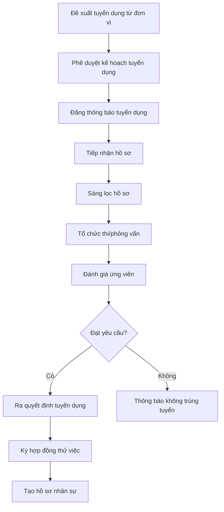
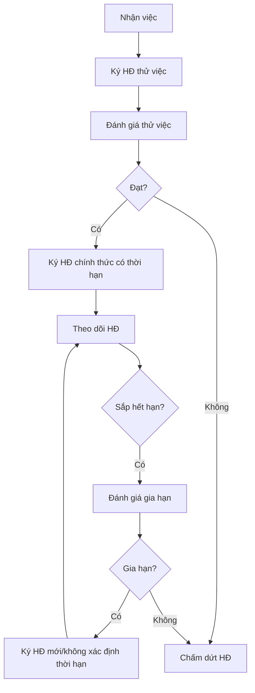
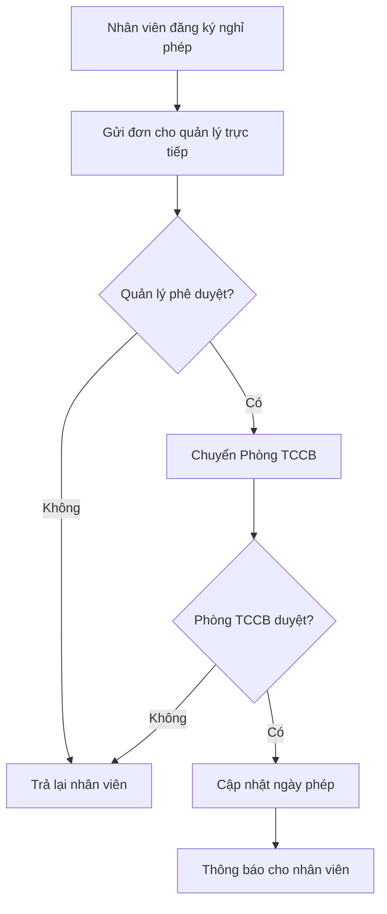
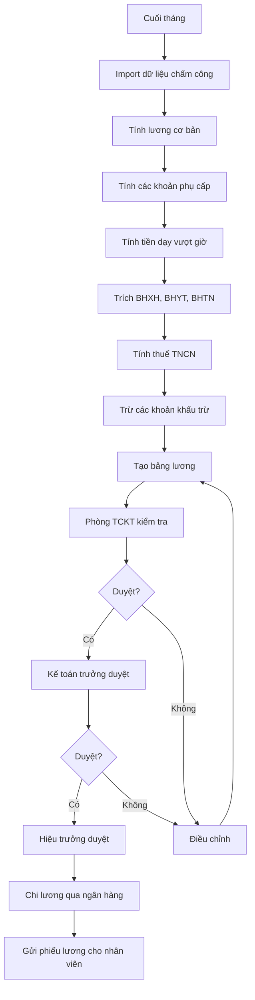
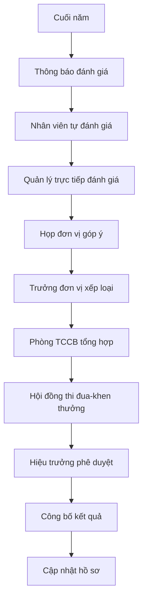

# Tài liệu Đặc tả Yêu cầu Người dùng
# Hệ thống Quản lý Nhân sự (HRMS) - Trường Đại học Thủy lợi

> **Phiên bản:** 1.0  
> **Ngày tạo:** 21/01/2026  
> **Dự án:** Phân tích và Thiết kế Phần mềm - Hệ thống Quản lý Nhân sự  
> **Đơn vị:** Trường Đại học Thủy lợi (TLU)

---

## Mục lục

1. [Giới thiệu](#1-giới-thiệu)
2. [Bối cảnh và Phạm vi](#2-bối-cảnh-và-phạm-vi)
3. [Các bên liên quan (Stakeholders)](#3-các-bên-liên-quan-stakeholders)
4. [Yêu cầu chức năng](#4-yêu-cầu-chức-năng)
5. [Yêu cầu phi chức năng](#5-yêu-cầu-phi-chức-năng)
6. [Mô hình nghiệp vụ](#6-mô-hình-nghiệp-vụ)
7. [Phụ lục](#7-phụ-lục)

---

## 1. Giới thiệu

### 1.1 Mục đích tài liệu

Tài liệu này mô tả chi tiết các yêu cầu người dùng cho Hệ thống Quản lý Nhân sự (Human Resource Management System - HRMS) được phát triển riêng cho Trường Đại học Thủy lợi. Tài liệu phục vụ làm cơ sở để:
- Phân tích và thiết kế hệ thống
- Xác định phạm vi và các tính năng cần phát triển
- Làm tài liệu tham chiếu cho việc kiểm thử và nghiệm thu

### 1.2 Giới thiệu về Trường Đại học Thủy lợi

**Trường Đại học Thủy lợi (Thuyloi University - TLU)** là cơ sở giáo dục đại học công lập trực thuộc Bộ Nông nghiệp và Môi trường với hơn **65 năm** lịch sử phát triển.

| Thông tin | Chi tiết |
|-----------|----------|
| Thành lập | 1959 (tiền thân: Học viện Thủy lợi Điện lực) |
| Loại hình | Đại học công lập |
| Cơ quan chủ quản | Bộ Nông nghiệp và Môi trường |
| Quy mô sinh viên | 24,000+ người học |
| Số ngành đào tạo | 43 chương trình đại học, 17 thạc sĩ, 15 tiến sĩ |
| Tỷ lệ giảng viên tiến sĩ | 60%+ |
| Đối tác | 500+ trong và ngoài nước |
| Cơ sở | Hà Nội (chính), TP. Hồ Chí Minh (phân hiệu) |

---

## 2. Bối cảnh và Phạm vi

### 2.1 Cơ cấu tổ chức cần quản lý

#### 2.1.1 Các đơn vị quản lý, phục vụ (Phòng/Ban)

| STT | Tên đơn vị | Mã đơn vị |
|-----|------------|-----------|
| 1 | Phòng Hành chính - Tổng hợp | HCTH |
| 2 | Phòng Tổ chức Cán bộ | TCCB |
| 3 | Phòng Đào tạo | DT |
| 4 | Phòng Khảo thí và Đảm bảo chất lượng | KTDBCL |
| 5 | Phòng Chính trị và Công tác sinh viên | CTCTSV |
| 6 | Phòng Khoa học công nghệ | KHCN |
| 7 | Phòng Hợp tác quốc tế | HTQT |
| 8 | Phòng Tài chính - Kế toán | TCKT |
| 9 | Phòng Quản trị - Thiết bị | QTTB |
| 10 | Thư viện | TV |
| 11 | Trung tâm Nội trú | TTNT |
| 12 | Trung tâm Tin học | TTTH |
| 13 | Trạm Y tế | TYT |

#### 2.1.2 Các đơn vị đào tạo (Khoa/Trung tâm)

| STT | Tên đơn vị | Mã đơn vị |
|-----|------------|-----------|
| 1 | Khoa Công trình | KCT |
| 2 | Khoa Kỹ thuật tài nguyên nước | KKTTN |
| 3 | Khoa Cơ khí | KCK |
| 4 | Khoa Điện - Điện tử | KDDT |
| 5 | Khoa Kinh tế và Quản lý | KKTQL |
| 6 | Khoa Công nghệ thông tin | KCNTT |
| 7 | Khoa Hóa và Môi trường | KHMT |
| 8 | Khoa Lý luận chính trị | KLLCT |
| 9 | Trung tâm Đào tạo quốc tế | TTDTQT |
| 10 | Trung tâm Giáo dục Quốc phòng và An ninh | TTGDQPAN |

#### 2.1.3 Các đơn vị KHCN kết hợp đào tạo (Viện/Trung tâm nghiên cứu)

| STT | Tên đơn vị | Mã đơn vị |
|-----|------------|-----------|
| 1 | Viện Đào tạo và KHƯD Miền Trung | VDTKHUDMT |
| 2 | Trung tâm Khoa học và Thiết kế KTTL | TTKHTK |
| 3 | Văn phòng Tư vấn thẩm định thiết kế | VPTVTD |
| 4 | Viện Kỹ thuật tài nguyên nước | VKTTNN |
| 5 | Viện Kỹ thuật công trình | VKTCT |
| 6 | Viện Thủy văn, Môi trường và BĐKH | VTVMTBDKH |
| 7 | Viện Thủy lợi và Môi trường (TP.HCM) | VTLMT_HCM |
| 8 | Công ty TNHH Tư vấn Trường ĐHTL | CTYTVTL |
| 9 | Trung tâm Nước và Môi trường VN-Hà Lan | TTMTVNHL |

#### 2.1.4 Phân hiệu TP. Hồ Chí Minh

- Là cơ sở đào tạo trực thuộc
- Có cơ cấu tổ chức riêng gồm: Ban Giám đốc, các phòng ban, khoa, trung tâm

### 2.2 Phạm vi hệ thống

Hệ thống HRMS sẽ quản lý toàn bộ nhân sự của trường bao gồm:

| Loại nhân sự | Mô tả |
|--------------|-------|
| **Giảng viên cơ hữu** | Giảng viên hợp đồng dài hạn/không xác định thời hạn |
| **Giảng viên thỉnh giảng** | Giảng viên hợp đồng theo kỳ/môn học |
| **Cán bộ quản lý** | Lãnh đạo trường, trưởng/phó phòng, khoa |
| **Nhân viên hành chính** | Chuyên viên các phòng ban |
| **Nhân viên phục vụ** | Bảo vệ, tạp vụ, kỹ thuật viên |
| **Nghiên cứu sinh** | NCS được tuyển dụng làm trợ giảng |
| **Cán bộ nước ngoài** | Giảng viên/chuyên gia nước ngoài |

---

## 3. Các bên liên quan (Stakeholders)

### 3.1 Người dùng hệ thống

| Vai trò | Mô tả | Quyền hạn chính |
|---------|-------|-----------------|
| **Quản trị viên hệ thống** | Phòng CNTT | Toàn quyền quản trị hệ thống, phân quyền |
| **Cán bộ Phòng TCCB** | Phòng Tổ chức Cán bộ | Quản lý hồ sơ, hợp đồng, chính sách nhân sự |
| **Cán bộ Phòng TCKT** | Phòng Tài chính - Kế toán | Quản lý lương, thưởng, các khoản thu chi |
| **Lãnh đạo trường** | Hiệu trưởng, Phó Hiệu trưởng | Phê duyệt, báo cáo tổng hợp |
| **Trưởng đơn vị** | Trưởng khoa/phòng/viện | Quản lý nhân sự đơn vị, đánh giá |
| **Cán bộ/Giảng viên** | Toàn bộ CBGV | Xem/cập nhật thông tin cá nhân, đăng ký nghỉ phép |

### 3.2 Các bên liên quan khác

- **Bộ Nông nghiệp và Môi trường**: Cơ quan chủ quản, yêu cầu báo cáo
- **Bộ Giáo dục và Đào tạo**: Quy định về chuẩn giảng viên
- **Bảo hiểm xã hội**: Đối chiếu thông tin BHXH, BHYT
- **Cơ quan thuế**: Báo cáo thuế TNCN

---

## 4. Yêu cầu chức năng

### 4.1 Module Quản lý Hồ sơ Nhân sự (Employee Records Management)

#### 4.1.1 Mô tả
Quản lý toàn diện thông tin của tất cả cán bộ, giảng viên, nhân viên trong trường.

#### 4.1.2 Yêu cầu chi tiết

| ID | Yêu cầu | Mức độ |
|----|---------|--------|
| **FR-ER-001** | Lưu trữ thông tin cá nhân: họ tên, ngày sinh, giới tính, CCCD/CMT, nơi sinh, quê quán, dân tộc, tôn giáo | Bắt buộc |
| **FR-ER-002** | Lưu trữ thông tin liên hệ: địa chỉ thường trú, địa chỉ tạm trú, số điện thoại, email cá nhân, email công việc | Bắt buộc |
| **FR-ER-003** | Lưu trữ thông tin gia đình: tình trạng hôn nhân, thông tin vợ/chồng, con cái, người phụ thuộc (để tính giảm trừ thuế TNCN) | Bắt buộc |
| **FR-ER-004** | Quản lý ảnh chân dung cán bộ (3x4, 4x6) | Bắt buộc |
| **FR-ER-005** | Lưu trữ thông tin ngân hàng: tên ngân hàng, số tài khoản, chi nhánh | Bắt buộc |
| **FR-ER-006** | Lưu trữ quá trình công tác trước khi vào trường | Bắt buộc |
| **FR-ER-007** | Lưu trữ thông tin Đảng viên: ngày vào Đảng, ngày chính thức, đảng bộ trực thuộc | Bắt buộc |
| **FR-ER-008** | Lưu trữ thông tin đoàn viên công đoàn | Tùy chọn |
| **FR-ER-009** | Tạo mã cán bộ tự động theo quy tắc của trường | Bắt buộc |
| **FR-ER-010** | Cho phép tìm kiếm, lọc hồ sơ theo nhiều tiêu chí | Bắt buộc |
| **FR-ER-011** | Xuất hồ sơ ra file (PDF, Excel, Word) theo mẫu | Bắt buộc |
| **FR-ER-012** | Lưu trữ lịch sử thay đổi hồ sơ (audit trail) | Bắt buộc |

### 4.2 Module Quản lý Trình độ và Chức danh (Qualifications Management)

#### 4.2.1 Mô tả
Quản lý trình độ học vấn, chức danh khoa học, chức vụ của cán bộ giảng viên.

#### 4.2.2 Yêu cầu chi tiết

| ID | Yêu cầu | Mức độ |
|----|---------|--------|
| **FR-QM-001** | Quản lý trình độ học vấn: cử nhân, thạc sĩ, tiến sĩ, tiến sĩ khoa học | Bắt buộc |
| **FR-QM-002** | Lưu trữ chi tiết bằng cấp: tên bằng, chuyên ngành, trường cấp, năm tốt nghiệp, xếp loại | Bắt buộc |
| **FR-QM-003** | Quản lý chức danh khoa học: Giáo sư, Phó Giáo sư | Bắt buộc |
| **FR-QM-004** | Quản lý học hàm giảng viên: Giảng viên, Giảng viên chính, Giảng viên cao cấp | Bắt buộc |
| **FR-QM-005** | Quản lý chứng chỉ: ngoại ngữ (IELTS, TOEFL, JLPT...), tin học, nghiệp vụ sư phạm | Bắt buộc |
| **FR-QM-006** | Cảnh báo chứng chỉ hết hạn | Bắt buộc |
| **FR-QM-007** | Quản lý chức vụ quản lý: Hiệu trưởng, Phó HT, Trưởng khoa, Phó khoa, Trưởng bộ môn... | Bắt buộc |
| **FR-QM-008** | Lưu trữ quá trình bổ nhiệm, miễn nhiệm chức vụ | Bắt buộc |
| **FR-QM-009** | Quản lý hồ sơ đào tạo bồi dưỡng trong nước và nước ngoài | Bắt buộc |
| **FR-QM-010** | Thống kê trình độ theo đơn vị, toàn trường | Bắt buộc |

### 4.3 Module Quản lý Hợp đồng Lao động (Contract Management)

#### 4.3.1 Mô tả
Quản lý toàn bộ vòng đời hợp đồng lao động theo quy định Bộ Luật Lao động 2019.

#### 4.3.2 Yêu cầu chi tiết

| ID | Yêu cầu | Mức độ |
|----|---------|--------|
| **FR-CM-001** | Quản lý các loại hợp đồng: Không xác định thời hạn, Xác định thời hạn (≤36 tháng), Hợp đồng thỉnh giảng | Bắt buộc |
| **FR-CM-002** | Lưu trữ thông tin hợp đồng: số HĐ, ngày ký, ngày hiệu lực, ngày hết hạn, nội dung công việc | Bắt buộc |
| **FR-CM-003** | Quản lý gia hạn hợp đồng | Bắt buộc |
| **FR-CM-004** | Quản lý chấm dứt hợp đồng: lý do, ngày chấm dứt, các khoản thanh toán | Bắt buộc |
| **FR-CM-005** | Cảnh báo hợp đồng sắp hết hạn (30, 60, 90 ngày trước) | Bắt buộc |
| **FR-CM-006** | Quản lý hợp đồng thử việc và chuyển đổi sang chính thức | Bắt buộc |
| **FR-CM-007** | Quản lý phụ lục hợp đồng | Bắt buộc |
| **FR-CM-008** | In hợp đồng theo mẫu chuẩn của trường | Bắt buộc |
| **FR-CM-009** | Quản lý hợp đồng với giảng viên/chuyên gia nước ngoài (gắn với work permit) | Bắt buộc |
| **FR-CM-010** | Tính toán trợ cấp thôi việc theo quy định | Bắt buộc |

### 4.4 Module Chấm công và Quản lý Nghỉ phép (Time & Attendance)

#### 4.4.1 Mô tả
Theo dõi thời gian làm việc, nghỉ phép của cán bộ nhân viên.

#### 4.4.2 Yêu cầu chi tiết

| ID | Yêu cầu | Mức độ |
|----|---------|--------|
| **FR-TA-001** | Tích hợp với máy chấm công (vân tay, thẻ từ, nhận diện khuôn mặt) | Bắt buộc |
| **FR-TA-002** | Quản lý các loại nghỉ phép: Phép năm, Ốm, Thai sản, Việc riêng, Không lương | Bắt buộc |
| **FR-TA-003** | Tự động tính số ngày phép năm theo thâm niên (12 ngày + cộng thêm theo thâm niên) | Bắt buộc |
| **FR-TA-004** | Quy trình đăng ký và phê duyệt nghỉ phép online | Bắt buộc |
| **FR-TA-005** | Thông báo email/SMS khi có đơn nghỉ phép cần duyệt | Bắt buộc |
| **FR-TA-006** | Thống kê ngày công theo tháng, quý, năm | Bắt buộc |
| **FR-TA-007** | Quản lý làm thêm giờ và phê duyệt | Bắt buộc |
| **FR-TA-008** | Quản lý công tác (đi công tác, hội nghị, hội thảo) | Bắt buộc |
| **FR-TA-009** | Đặc thù: Quản lý giờ giảng của giảng viên | Bắt buộc |
| **FR-TA-010** | Báo cáo tổng hợp chấm công theo đơn vị | Bắt buộc |

### 4.5 Module Quản lý Tiền lương và Phúc lợi (Payroll & Benefits)

#### 4.5.1 Mô tả
Tính toán và quản lý lương, các khoản phụ cấp, bảo hiểm theo quy định của nhà nước và trường.

#### 4.5.2 Yêu cầu chi tiết

| ID | Yêu cầu | Mức độ |
|----|---------|--------|
| **FR-PB-001** | Quản lý bảng lương theo ngạch, bậc công chức/viên chức | Bắt buộc |
| **FR-PB-002** | Tính lương cơ bản = Hệ số lương × Mức lương cơ sở | Bắt buộc |
| **FR-PB-003** | Quản lý các loại phụ cấp: chức vụ, thâm niên, ưu đãi ngành, độc hại, khu vực... | Bắt buộc |
| **FR-PB-004** | Tính phụ cấp thâm niên nhà giáo (5% sau 5 năm, +1%/năm tiếp theo) | Bắt buộc |
| **FR-PB-005** | Quản lý nâng bậc lương định kỳ và trước hạn | Bắt buộc |
| **FR-PB-006** | Tính thu nhập tăng thêm (nếu có) | Tùy chọn |
| **FR-PB-007** | Tính tiền dạy vượt giờ cho giảng viên | Bắt buộc |
| **FR-PB-008** | Trích BHXH, BHYT, BHTN theo quy định (BHXH: 8%, BHYT: 1.5%, BHTN: 1%) | Bắt buộc |
| **FR-PB-009** | Tính thuế TNCN tự động | Bắt buộc |
| **FR-PB-010** | Quản lý các khoản tạm ứng, khấu trừ | Bắt buộc |
| **FR-PB-011** | Tạo bảng lương hàng tháng | Bắt buộc |
| **FR-PB-012** | In phiếu lương và gửi email cho nhân viên | Bắt buộc |
| **FR-PB-013** | Xuất file ngân hàng để chi lương | Bắt buộc |
| **FR-PB-014** | Kết nối cổng BHXH điện tử | Tùy chọn |
| **FR-PB-015** | Quản lý thưởng: Lễ, Tết, thành tích... | Bắt buộc |

### 4.6 Module Tuyển dụng (Recruitment)

#### 4.6.1 Mô tả
Quản lý quy trình tuyển dụng từ đăng tin đến nhận việc.

#### 4.6.2 Yêu cầu chi tiết

| ID | Yêu cầu | Mức độ |
|----|---------|--------|
| **FR-RC-001** | Tạo và quản lý thông báo tuyển dụng | Bắt buộc |
| **FR-RC-002** | Quản lý vị trí tuyển dụng: mô tả công việc, yêu cầu, số lượng | Bắt buộc |
| **FR-RC-003** | Tiếp nhận hồ sơ ứng viên online | Bắt buộc |
| **FR-RC-004** | Sàng lọc hồ sơ theo tiêu chí | Bắt buộc |
| **FR-RC-005** | Lập kế hoạch và quản lý lịch phỏng vấn | Bắt buộc |
| **FR-RC-006** | Đánh giá ứng viên qua các vòng thi/phỏng vấn | Bắt buộc |
| **FR-RC-007** | Gửi thông báo kết quả cho ứng viên (email/SMS) | Bắt buộc |
| **FR-RC-008** | Quản lý ngân hàng ứng viên tiềm năng | Tùy chọn |
| **FR-RC-009** | Tạo hồ sơ nhân sự từ ứng viên trúng tuyển | Bắt buộc |
| **FR-RC-010** | Báo cáo thống kê tuyển dụng | Bắt buộc |

### 4.7 Module Đánh giá và Khen thưởng - Kỷ luật (Performance & Rewards)

#### 4.7.1 Mô tả
Quản lý đánh giá hiệu quả công việc, khen thưởng và kỷ luật.

#### 4.7.2 Yêu cầu chi tiết

| ID | Yêu cầu | Mức độ |
|----|---------|--------|
| **FR-PR-001** | Đánh giá viên chức hàng năm theo các tiêu chí | Bắt buộc |
| **FR-PR-002** | Phân loại đánh giá: Xuất sắc, Tốt, Hoàn thành, Không hoàn thành | Bắt buộc |
| **FR-PR-003** | Quy trình tự đánh giá và phê duyệt nhiều cấp | Bắt buộc |
| **FR-PR-004** | Đánh giá giảng viên: công tác giảng dạy, NCKH, phục vụ cộng đồng | Bắt buộc |
| **FR-PR-005** | Quản lý các hình thức khen thưởng: Giấy khen, Bằng khen, Huân chương, Danh hiệu | Bắt buộc |
| **FR-PR-006** | Quản lý các hình thức kỷ luật: Khiển trách, Cảnh cáo, Hạ bậc lương, Buộc thôi việc | Bắt buộc |
| **FR-PR-007** | Lưu trữ hồ sơ khen thưởng/kỷ luật | Bắt buộc |
| **FR-PR-008** | Kết nối với module lương để tính thưởng | Bắt buộc |
| **FR-PR-009** | Theo dõi danh hiệu thi đua theo năm | Bắt buộc |
| **FR-PR-010** | Báo cáo tổng hợp khen thưởng, kỷ luật | Bắt buộc |

### 4.8 Module Đào tạo và Phát triển (Training & Development)

#### 4.8.1 Mô tả
Quản lý hoạt động đào tạo, bồi dưỡng nâng cao năng lực cho CBGV.

#### 4.8.2 Yêu cầu chi tiết

| ID | Yêu cầu | Mức độ |
|----|---------|--------|
| **FR-TD-001** | Lập kế hoạch đào tạo năm | Bắt buộc |
| **FR-TD-002** | Quản lý các khóa đào tạo, bồi dưỡng: trong nước, nước ngoài | Bắt buộc |
| **FR-TD-003** | Quản lý cử đi học: NCS, Thạc sĩ, Tiến sĩ | Bắt buộc |
| **FR-TD-004** | Quản lý cam kết đào tạo (ràng buộc sau đào tạo) | Bắt buộc |
| **FR-TD-005** | Theo dõi tiến độ học tập của CBGV đi học | Bắt buộc |
| **FR-TD-006** | Quản lý kinh phí đào tạo | Tùy chọn |
| **FR-TD-007** | Đánh giá hiệu quả sau đào tạo | Tùy chọn |
| **FR-TD-008** | Quản lý chứng chỉ đạt được sau đào tạo | Bắt buộc |
| **FR-TD-009** | Báo cáo thống kê đào tạo theo đơn vị, loại hình | Bắt buộc |

### 4.9 Module Nghiên cứu Khoa học (Research Management)

#### 4.9.1 Mô tả
Quản lý hoạt động NCKH của giảng viên (đặc thù môi trường đại học).

#### 4.9.2 Yêu cầu chi tiết

| ID | Yêu cầu | Mức độ |
|----|---------|--------|
| **FR-RM-001** | Quản lý đề tài NCKH: cấp trường, cấp bộ, cấp nhà nước | Bắt buộc |
| **FR-RM-002** | Theo dõi công bố khoa học: bài báo, sách, patent | Bắt buộc |
| **FR-RM-003** | Tính giờ nghiên cứu khoa học cho giảng viên | Bắt buộc |
| **FR-RM-004** | Quản lý hướng dẫn NCS, học viên cao học | Bắt buộc |
| **FR-RM-005** | Báo cáo thống kê hoạt động NCKH | Bắt buộc |
| **FR-RM-006** | Kết nối với đánh giá giảng viên | Bắt buộc |

### 4.10 Module Quản lý Giờ giảng (Teaching Load Management)

#### 4.10.1 Mô tả
Quản lý định mức giờ giảng và thực hiện giờ giảng của giảng viên (đặc thù đại học).

#### 4.10.2 Yêu cầu chi tiết

| ID | Yêu cầu | Mức độ |
|----|---------|--------|
| **FR-TL-001** | Quản lý định mức giờ giảng theo chức danh, học hàm | Bắt buộc |
| **FR-TL-002** | Quy đổi giờ giảng: lý thuyết, thực hành, hướng dẫn đồ án | Bắt buộc |
| **FR-TL-003** | Theo dõi số giờ giảng thực tế theo học kỳ, năm học | Bắt buộc |
| **FR-TL-004** | Tính giờ vượt định mức | Bắt buộc |
| **FR-TL-005** | Quy đổi các hoạt động khác ra giờ giảng chuẩn | Bắt buộc |
| **FR-TL-006** | Tích hợp với hệ thống đào tạo để lấy dữ liệu phân công giảng dạy | Tùy chọn |
| **FR-TL-007** | Báo cáo giờ giảng theo giảng viên, khoa, bộ môn | Bắt buộc |

### 4.11 Module Báo cáo và Thống kê (Reporting & Analytics)

#### 4.11.1 Mô tả
Tạo các báo cáo tổng hợp phục vụ quản lý và báo cáo cơ quan chủ quản.

#### 4.11.2 Yêu cầu chi tiết

| ID | Yêu cầu | Mức độ |
|----|---------|--------|
| **FR-RP-001** | Báo cáo tổng hợp nhân sự theo đơn vị, toàn trường | Bắt buộc |
| **FR-RP-002** | Báo cáo cơ cấu nhân sự: trình độ, độ tuổi, giới tính | Bắt buộc |
| **FR-RP-003** | Báo cáo biến động nhân sự: tuyển mới, nghỉ việc, điều chuyển | Bắt buộc |
| **FR-RP-004** | Báo cáo theo mẫu Bộ GD&ĐT, Bộ NN&MT | Bắt buộc |
| **FR-RP-005** | Báo cáo lương theo đơn vị, toàn trường | Bắt buộc |
| **FR-RP-006** | Báo cáo BHXH, thuế TNCN | Bắt buộc |
| **FR-RP-007** | Dashboard tổng quan nhân sự | Bắt buộc |
| **FR-RP-008** | Xuất báo cáo ra Excel, PDF, Word | Bắt buộc |
| **FR-RP-009** | Lập báo cáo theo kỳ (tháng, quý, năm) | Bắt buộc |
| **FR-RP-010** | Cho phép tạo báo cáo tùy chỉnh | Tùy chọn |

### 4.12 Module Self-Service Portal (Cổng nhân viên)

#### 4.12.1 Mô tả
Cho phép cán bộ, giảng viên tự phục vụ một số tác vụ cơ bản.

#### 4.12.2 Yêu cầu chi tiết

| ID | Yêu cầu | Mức độ |
|----|---------|--------|
| **FR-SS-001** | Xem thông tin cá nhân | Bắt buộc |
| **FR-SS-002** | Đề nghị cập nhật thông tin cá nhân | Bắt buộc |
| **FR-SS-003** | Xem phiếu lương hàng tháng | Bắt buộc |
| **FR-SS-004** | Đăng ký nghỉ phép online | Bắt buộc |
| **FR-SS-005** | Xem số ngày phép còn lại | Bắt buộc |
| **FR-SS-006** | Xem lịch sử hợp đồng | Bắt buộc |
| **FR-SS-007** | Xem kết quả đánh giá | Bắt buộc |
| **FR-SS-008** | Xem thông tin đào tạo, bồi dưỡng | Bắt buộc |
| **FR-SS-009** | Cập nhật thông tin đăng ký thuế TNCN (người phụ thuộc) | Bắt buộc |
| **FR-SS-010** | Nhận thông báo từ Phòng TCCB, Phòng TCKT | Bắt buộc |

---

## 5. Yêu cầu phi chức năng

### 5.1 Hiệu năng (Performance)

| ID | Yêu cầu | Chi tiết |
|----|---------|----------|
| **NFR-PF-001** | Thời gian phản hồi | Trang thông thường < 2 giây, báo cáo phức tạp < 10 giây |
| **NFR-PF-002** | Số người dùng đồng thời | Hỗ trợ tối thiểu 500 người dùng đồng thời |
| **NFR-PF-003** | Tính toán lương | Tính lương cho toàn bộ nhân sự (ước tính ~1500 người) < 5 phút |

### 5.2 Bảo mật (Security)

| ID | Yêu cầu | Chi tiết |
|----|---------|----------|
| **NFR-SC-001** | Xác thực | Hỗ trợ đăng nhập username/password, SSO với hệ thống trường |
| **NFR-SC-002** | Phân quyền | Phân quyền dựa trên vai trò (RBAC); phân quyền đến mức field |
| **NFR-SC-003** | Mã hóa | Mã hóa dữ liệu nhạy cảm (lương, CCCD); HTTPS cho web |
| **NFR-SC-004** | Audit log | Ghi lại tất cả thao tác quan trọng |
| **NFR-SC-005** | Bảo mật phiên | Session timeout 30 phút không hoạt động |
| **NFR-SC-006** | Chính sách mật khẩu | Mật khẩu tối thiểu 8 ký tự, bao gồm chữ hoa, chữ thường, số |

### 5.3 Khả dụng và Tin cậy (Availability & Reliability)

| ID | Yêu cầu | Chi tiết |
|----|---------|----------|
| **NFR-AV-001** | Uptime | 99.5% trong giờ hành chính |
| **NFR-AV-002** | Sao lưu | Backup tự động hàng ngày, lưu trữ 30 ngày |
| **NFR-AV-003** | Phục hồi | RTO < 4 giờ, RPO < 24 giờ |

### 5.4 Khả năng mở rộng (Scalability)

| ID | Yêu cầu | Chi tiết |
|----|---------|----------|
| **NFR-SC-001** | Dữ liệu | Hỗ trợ lưu trữ hồ sơ tối thiểu 10 năm |
| **NFR-SC-002** | Người dùng | Kiến trúc cho phép mở rộng khi cần |

### 5.5 Khả năng sử dụng (Usability)

| ID | Yêu cầu | Chi tiết |
|----|---------|----------|
| **NFR-US-001** | Giao diện | Giao diện tiếng Việt, thân thiện, responsive |
| **NFR-US-002** | Đào tạo | Người dùng mới sử dụng được các chức năng cơ bản sau 4 giờ đào tạo |
| **NFR-US-003** | Tài liệu | Có tài liệu hướng dẫn sử dụng đầy đủ |
| **NFR-US-004** | Mobile | Hỗ trợ truy cập từ mobile/tablet cho Self-Service Portal |

### 5.6 Tích hợp (Integration)

| ID | Yêu cầu | Chi tiết |
|----|---------|----------|
| **NFR-IN-001** | Chấm công | Tích hợp với máy chấm công hiện có |
| **NFR-IN-002** | Đào tạo | API tích hợp với hệ thống quản lý đào tạo |
| **NFR-IN-003** | Tài chính | Xuất dữ liệu tương thích với phần mềm kế toán |
| **NFR-IN-004** | BHXH | Hỗ trợ xuất file theo chuẩn BHXH điện tử |
| **NFR-IN-005** | Thuế | Xuất báo cáo thuế TNCN theo mẫu quy định |

### 5.7 Tuân thủ pháp luật (Compliance)

| ID | Yêu cầu | Chi tiết |
|----|---------|----------|
| **NFR-CP-001** | Luật Lao động | Tuân thủ Bộ Luật Lao động 2019 |
| **NFR-CP-002** | Luật BHXH | Tuân thủ Luật Bảo hiểm xã hội |
| **NFR-CP-003** | Luật Thuế TNCN | Tuân thủ quy định thuế thu nhập cá nhân |
| **NFR-CP-004** | Luật Giáo dục | Tuân thủ Luật Giáo dục 2019, Luật Giáo dục đại học |
| **NFR-CP-005** | Quy định viên chức | Tuân thủ Luật Viên chức và các văn bản hướng dẫn |

---

## 6. Mô hình nghiệp vụ

### 6.1 Quy trình tuyển dụng

### 6.2 Quy trình quản lý hợp đồng

### 6.3 Quy trình nghỉ phép

### 6.4 Quy trình tính lương

### 6.5 Quy trình đánh giá viên chức

---

## 7. Phụ lục

### 7.1 Danh mục loại hợp đồng

| Mã | Loại hợp đồng | Thời hạn | Ghi chú |
|----|---------------|----------|---------|
| HD01 | Không xác định thời hạn | Không giới hạn | Cho viên chức chính thức |
| HD02 | Xác định thời hạn | 12-36 tháng | Lần 1, lần 2 |
| HD03 | Thử việc | 30-60 ngày | Theo vị trí |
| HD04 | Thỉnh giảng | Theo học kỳ | Cho GV thỉnh giảng |
| HD05 | Chuyên gia nước ngoài | Theo work permit | Cho GV/CG nước ngoài |

### 7.2 Bảng hệ số lương viên chức

| Chức danh | Mã ngạch | Bậc | Hệ số |
|-----------|----------|-----|-------|
| Giảng viên cao cấp | V.07.01.01 | 1-6 | 6.20 - 8.00 |
| Giảng viên chính | V.07.01.02 | 1-8 | 4.40 - 6.78 |
| Giảng viên | V.07.01.03 | 1-9 | 2.34 - 4.98 |
| Chuyên viên cao cấp | 01.001 | 1-6 | 6.20 - 8.00 |
| Chuyên viên chính | 01.002 | 1-8 | 4.40 - 6.78 |
| Chuyên viên | 01.003 | 1-9 | 2.34 - 4.98 |

### 7.3 Danh mục phụ cấp

| Mã | Loại phụ cấp | Công thức |
|----|--------------|-----------|
| PC01 | Phụ cấp chức vụ | Hệ số × Lương cơ sở |
| PC02 | Phụ cấp thâm niên nhà giáo | 5% sau 5 năm + 1%/năm |
| PC03 | Phụ cấp ưu đãi ngành | 25-30% × Lương ngạch bậc |
| PC04 | Phụ cấp trách nhiệm | Theo quyết định |
| PC05 | Phụ cấp độc hại | Theo quy định |

### 7.4 Quy định nghỉ phép

| Loại | Số ngày | Điều kiện |
|------|---------|-----------|
| Phép năm | 12 ngày | Làm đủ 12 tháng |
| Phép năm (thâm niên) | +1 ngày/5 năm | Cộng thêm theo thâm niên |
| Thai sản (nữ) | 6 tháng | Theo Luật Lao động |
| Thai sản (nam) | 5-14 ngày | Tùy trường hợp sinh |
| Ốm đau | Theo BHXH | Có giấy xác nhận |
| Việc riêng có lương | 3 ngày | Kết hôn, tang chế |

### 7.5 Thuật ngữ

| Thuật ngữ | Giải thích |
|-----------|------------|
| CBGV | Cán bộ giảng viên |
| BHXH | Bảo hiểm xã hội |
| BHYT | Bảo hiểm y tế |
| BHTN | Bảo hiểm thất nghiệp |
| TNCN | Thu nhập cá nhân |
| NCKH | Nghiên cứu khoa học |
| NCS | Nghiên cứu sinh |
| HĐ | Hợp đồng |
| TCCB | Tổ chức cán bộ |
| TCKT | Tài chính - Kế toán |

---

> **Ghi chú:** Tài liệu này được xây dựng dựa trên nghiên cứu về cơ cấu tổ chức Trường Đại học Thủy lợi, các quy định pháp luật Việt Nam về lao động, viên chức, giáo dục, và các thực hành tốt nhất về hệ thống HRMS trong môi trường đại học. Cần được review và bổ sung bởi các bên liên quan trước khi finalize.
